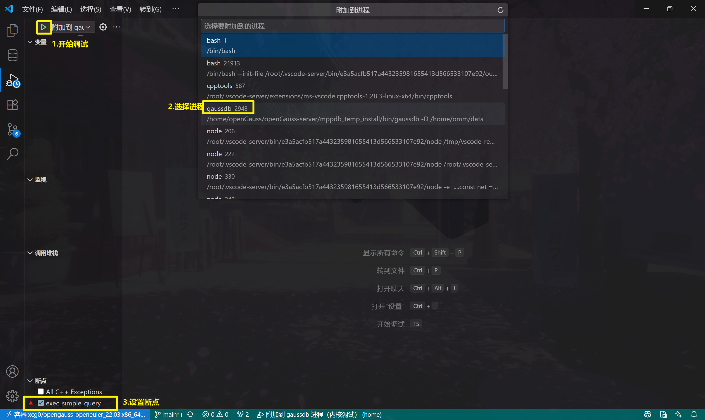
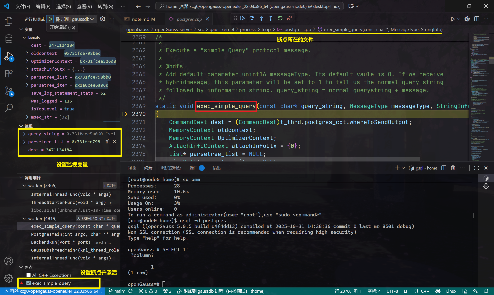

# openGauss 使用说明

> **📌 新增：[多节点集群部署指南](docs/multi-node/QUICKSTART.md)** - 一主两备高可用集群快速部署

## 目录

- [单节点部署](#单节点部署)
  - [宿主机相关准备](#宿主机相关准备)
  - [创建 Docker 容器](#创建-docker-容器)
  - [数据库启动](#数据库启动)
  - [在 VS Code 中调试 openGauss 数据库内核](#在-vs-code-中调试-opengauss-数据库内核)
- [多节点集群部署](#多节点集群部署)

---

## 单节点部署

### 宿主机相关准备

1. [安装 docker](https://blog.csdn.net/Cike___/article/details/146415836)，每次连接 docker 容器前**务必确保 Docker Desktop 已启动**。
    

2. 安装 [VS Code](https://code.visualstudio.com/)，并安装相关插件：
    
    > 具体使用方法参考：[在 VS Code 中使用 docker](https://zhuanlan.zhihu.com/p/496213879)。

## 使用方法

### 创建 Docker 容器

1. 在宿主机上拉取镜像，[镜像仓库地址](https://hub.docker.com/repository/docker/xcg0/opengauss-openeuler_22.03/general)：

    ```bash
    # 使用 Windows 版本
    docker pull xcg0/opengauss-openeuler_22.03:x86_64

    # 使用 macOS 版本
    docker pull xcg0/opengauss-openeuler_22.03:aarch64
    ```

2. 在宿主机上启动容器（注意替换 `--name` 与 `--hostname` 参数）：

    ```powershell
    # Windows PowerShell
    docker run -itd --name opengauss-node0 `
      --hostname node0 `
      --privileged=true `
      -p 127.0.0.1:5432:5432 `
      -v ${PWD}/init-container.sh:/init-container.sh:ro `
      xcg0/opengauss-openeuler_22.03:x86_64 `
      bash /init-container.sh

    # macOS / Linux
    docker run -itd --name opengauss-node0 \
      --hostname node0 \
      --privileged=true \
      -p 127.0.0.1:5432:5432 \
      -v $(pwd)/init-container.sh:/init-container.sh:ro \
      xcg0/opengauss-openeuler_22.03:aarch64 \
      bash /init-container.sh
    ```

3. 使用 VS Code 连接容器，进入 `\home` 目录。
    
    > **注意**：创建容器时会使用 [init-container.sh](../../init-container.sh) 脚本在 `\home` 初始化 Git 仓库并拉取代码。如果不想继续跟踪后续代码，请删除 `/home/.git` 目录。
    
    
    
    > 在容器中的 root 用户下运行 `code ‘文件夹路径或文件路径’` 可以直接在 VSCode 中打开。

    `\home` 目录结构（文件夹）如下，其中 **`\omm` 和 `\openGauss` 目录为数据库相关文件，由于体积较大，未包含在 Git 仓库中**：

    ```
    home
    ├── .vscode          # VS Code 编译配置文件
    ├── docs             # 组会演示文档 
    ├── images
    ├── openGauss
    │     ├──openGauss-server # openGauss 数据库
    │     └──binarylibs       # 第三方依赖库
    └── omm
        ├── data          # 数据库数据文件
        └── log           # 数据库日志文件
    ```

### 数据库启动

操作数据库时，**务必使用 `omm` 用户身份**（执行 `su omm` 切换用户）。


1. 启动数据库（单节点）

    ```bash
    gs_ctl start -D /home/omm/data -Z single_node -l /home/omm/log/opengauss.log
    ```

    > 正常启动输出如下：
    > 
    > ```
    > [2025-10-22 13:16:44.405][1532773][][gs_ctl]: gs_ctl started,datadir is /home/omm/data 
    > [2025-10-22 13:16:44.572][1532773][][gs_ctl]: waiting for server to start...
    > .
    > [2025-10-22 13:16:46.570][1532773][][gs_ctl]:  done
    > [2025-10-22 13:16:46.570][1532773][][gs_ctl]: server started (/home/omm/data)
    > ```


2. 查询数据库状态

    ```bash
    gs_ctl query -D /home/omm/data
    ```

    > 状态正常时输出如下：
    > 
    > ```
    > [2025-10-22 13:17:42.333][1533927][][gs_ctl]: gs_ctl query ,datadir is /home/omm/data 
    >  HA state:           
    >         local_role                     : Normal
    >         static_connections             : 0
    >         db_state                       : Normal
    >         detail_information             : Normal
    > 
    >  Senders info:       
    > No information 
    >  Receiver info:      
    > No information 
    > ```

3. 关闭数据库

    ```bash
    gs_ctl stop -D /home/omm/data
    ```

    > 正常关闭时输出如下：
    > 
    > ```
    > [2025-10-22 13:16:08.621][1531932][][gs_ctl]: gs_ctl stopped ,datadir is /home/omm/data 
    > waiting for server to shut down...... done
    > server stopped
    > ```

4. 使用 VSCode PostgreSQL 插件连接数据库：

    在 PostgreSQL 插件中创建连接，连接类型选择 `PostgreSQL`，填写连接信息，保存并连接。

    

    > 需要先启动数据库 `gs_ctl start ……`，才能连接成功。

### 在 VS Code 中调试 openGauss 数据库内核

#### 在 VS Code 中启动调试

- 按 `F5` 选择"附加到 gaussdb 进程（内核调试）"
- 在进程列表中选择目标进程（这一步可能需要十几秒左右加载进程列表）
- 设置断点并执行 SQL 触发




#### 常用调试场景

> 可以点击链接跳转到断点所对应的代码位置。

| 场景 | 关键断点 | 调试目标 | 示例 SQL |
|------|---------|---------|---------|
| **1. 查询执行流程** | [`exec_simple_query()`](openGauss/openGauss-server/src/gausskernel/process/tcop/postgres.cpp#L2369)<br>[`pg_parse_query()`](openGauss/openGauss-server/src/gausskernel/process/tcop/postgres.cpp#L1010)<br>[`pg_plan_queries()`](openGauss/openGauss-server/src/gausskernel/process/tcop/postgres.cpp#L1485)<br>[`ExecutorRun()`](openGauss/openGauss-server/src/gausskernel/runtime/executor/execMain.cpp#L444) | SQL 解析→优化→执行完整流程 | `INSERT INTO test VALUES (1, 'x');`<br>`SELECT * FROM test;` |
| **2. 事务和 MVCC** | [`StartTransaction()`](openGauss/openGauss-server/src/gausskernel/storage/access/transam/xact.cpp#L2307)<br>[`GetTransactionSnapshot()`](openGauss/openGauss-server/src/common/backend/utils/time/snapmgr.cpp#L479)<br>[`HeapTupleSatisfiesMVCC()`](openGauss/openGauss-server/src/gausskernel/storage/access/heap/heapam_visibility.cpp#L1026)<br>[`CommitTransaction()`](openGauss/openGauss-server/src/gausskernel/storage/access/transam/xact.cpp#L2583) | 快照隔离、可见性判断 | 两会话并发读写同一行 |
| **3. 锁机制** | [`LockAcquire()`](openGauss/openGauss-server/src/gausskernel/storage/lmgr/lock.cpp#L533)<br>[`LockRelease()`](openGauss/openGauss-server/src/gausskernel/storage/lmgr/lock.cpp#L1860)<br>[`DeadLockCheck()`](openGauss/openGauss-server/src/gausskernel/storage/lmgr/deadlock.cpp#L191)<br>[`ProcSleep()`](openGauss/openGauss-server/src/gausskernel/storage/lmgr/proc.cpp#L1748) | 锁冲突、死锁检测 | 两会话交叉更新不同行 |
| **4. 缓冲区管理** | [`ReadBuffer()`](openGauss/openGauss-server/src/gausskernel/storage/buffer/bufmgr.cpp#L1632)<br>[`BufferAlloc()`](openGauss/openGauss-server/src/gausskernel/storage/buffer/bufmgr.cpp#L354)<br>[`FlushBuffer()`](openGauss/openGauss-server/src/gausskernel/storage/buffer/bufmgr.cpp#L4664)<br>[`StrategyGetBuffer()`](openGauss/openGauss-server/src/gausskernel/storage/buffer/freelist.cpp#L180) | 页面读取、缓冲区替换策略 | 大表全表扫描 |
| **5. 索引操作** | [`_bt_search()`](openGauss/openGauss-server/src/gausskernel/storage/access/nbtree/nbtsearch.cpp#L60)<br>[`_bt_split()`](openGauss/openGauss-server/src/gausskernel/storage/access/nbtree/nbtinsert.cpp#L74) | B-Tree 查找/分裂 | `CREATE INDEX`<br>索引查询 |
| **6. WAL 和恢复** | [`XLogInsert()`](openGauss/openGauss-server/src/gausskernel/storage/access/transam/xloginsert.cpp#L505)<br>[`StartupXLOG()`](openGauss/openGauss-server/src/gausskernel/storage/access/transam/xlog.cpp#L8741) | 日志写入、崩溃恢复 | 模拟崩溃后重启 |
| **7. 并发控制** | [`heap_hot_search()`](openGauss/openGauss-server/src/gausskernel/storage/access/heap/heapam.cpp#L2600)<br>[`heap_page_prune()`](openGauss/openGauss-server/src/gausskernel/storage/access/heap/pruneheap.cpp#L173)<br>[`vacuum_rel()`](openGauss/openGauss-server/src/gausskernel/optimizer/commands/vacuum.cpp#L130) | HOT 更新、页面清理 | 频繁更新同一页数据 |
| **8. 优化器决策** | [`planner()`](openGauss/openGauss-server/src/gausskernel/optimizer/plan/planner.cpp#L370)<br>[`create_plan()`](openGauss/openGauss-server/src/gausskernel/optimizer/plan/createplan.cpp#L302)<br>[`cost_seqscan()`](openGauss/openGauss-server/src/gausskernel/optimizer/path/costsize.cpp#L640)<br>[`cost_index()`](openGauss/openGauss-server/src/gausskernel/optimizer/path/costsize.cpp#L976) | 执行计划生成、代价估算 | `EXPLAIN` 对比不同查询计划 |
| **9. 内存管理** | [`MemoryContextReset()`](openGauss/openGauss-server/src/common/backend/utils/mmgr/mcxt.cpp#L215)<br>[`MemoryContextDelete()`](openGauss/openGauss-server/src/common/backend/utils/mmgr/mcxt.cpp#L364) | 内存分配与释放 | 执行复杂查询观察内存 |
| **10. 扩展功能** | [`ExecCallTriggerFunc()`](openGauss/openGauss-server/src/gausskernel/optimizer/commands/trigger.cpp#L96)<br>[`exec_stmt_execsql()`](openGauss/openGauss-server/src/common/pl/plpgsql/src/pl_exec.cpp#L144)<br>[`fmgr_info()`](openGauss/openGauss-server/src/common/backend/utils/fmgr/fmgr.cpp#L246) | 触发器、存储过程执行 | 创建并触发触发器 |

#### 查询执行流程调试示例

以 `exec_simple_query` 断点为例。监视变量：
1. `query_string`：当前执行的 SQL 语句
2. `parsetree_list`：解析后的语法树列表

调试步骤如下表所示：

| 序号 | 终端1 (GDB) | 终端2 (gsql) | 命令 | 简单说明 |
|------:|:-------------:|:--------------:|:------:|:----|
| 1 | 🔴 |&nbsp;| `gdb -p 1148` | 附加到主进程(PID 从 4.2 步骤获得) |
| 2 | 🔴 |&nbsp;| `handle SIGUSR1 nostop noprint pass` | 忽略 SIGUSR1 信号(避免调试中断) |
| 3 | 🔴 |&nbsp;| `break exec_simple_query` | 在 SQL 执行入口函数设置断点 |
| 4 | 🔴 |&nbsp;| `continue` | 继续执行,等待断点触发 |
| 5 |&nbsp;| 🟡 | `gsql -d postgres` | 连接到 postgres 数据库 |
| 6 |&nbsp;| 🟡 | `SELECT 1;` | 执行 SQL(触发 GDB 断点) |
| 7 | 🔴 |&nbsp;| `list` | 显示当前断点处的源代码 |
| 8 | 🔴 |&nbsp;| `print query_string` | 打印当前执行的 SQL 语句 |
| 9 | 🔴 |&nbsp;| `backtrace` | 显示完整调用栈(函数调用链) |
| 10 | 🔴 |&nbsp;| `next` | 单步执行(跳过函数) |
| 11 | 🔴 |&nbsp;| `step` | 单步进入函数内部 |
| 12 | 🔴 |&nbsp;| `info locals` | 显示所有局部变量 |
| 13 | 🔴 |&nbsp;| `continue` | 继续执行到下一个断点或结束 |
| 14 |&nbsp;| 🟡 | (查看 SQL 执行结果) | 终端显示查询结果: `?column? = 1` |
| 15 | 🔴 |&nbsp;| `quit` → `y` | 退出 GDB,选择 `y` 确认分离进程 |
| 16 |&nbsp;| 🟡 | `\q` | 退出 gsql 客户端 |

> 注意终端返回了执行结果后再执行下一条命令，没返回结果继续 `continue` 即可。
>
> VS Code 调试界面中也可以完成上述 GDB 命令操作，终端 1 可以使用 VS Code 调试界面，终端 2 使用 VS Code 内置终端即可。
>
> 

---

## 多节点集群部署

想要部署 openGauss 一主两备的高可用集群？请参考：

📖 **[多节点集群快速部署指南](docs/multi-node/QUICKSTART.md)**

### 特性

- ✅ 一主两备架构
- ✅ 自动主备复制
- ✅ 故障自动切换
- ✅ 数据同步验证
- ✅ 完整的部署脚本

### 快速开始

```powershell
# Windows PowerShell
cd docs\multi-node\scripts
.\01_create_containers.ps1

# 进入主节点容器
docker exec -it opengauss-primary bash

# 在容器内依次执行
cd /home/scripts
bash 02_setup_ssh.sh      # 配置 SSH 互信
bash 03_init_cluster.sh   # 初始化集群
bash 04_start_cluster.sh  # 启动集群
bash 05_verify_cluster.sh # 验证集群
```

详细说明和故障排查请参考 [完整文档](docs/multi-node/README.md)。

