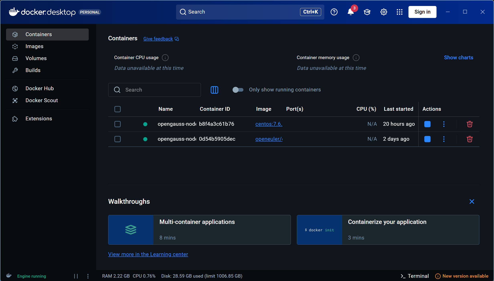
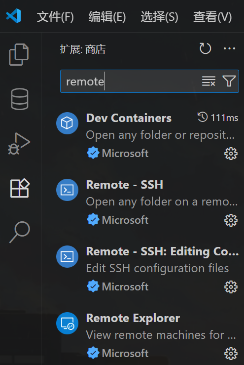
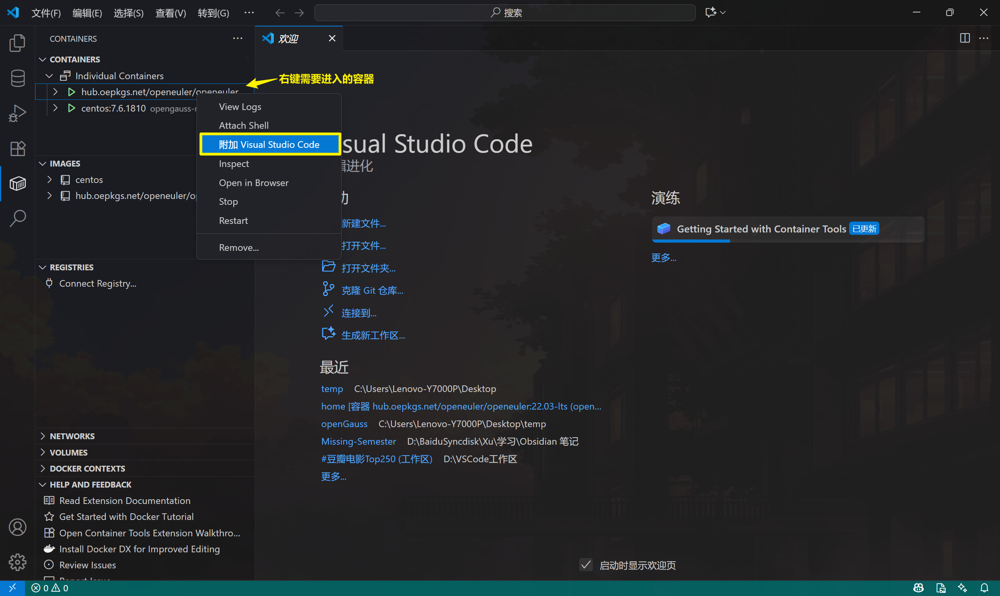
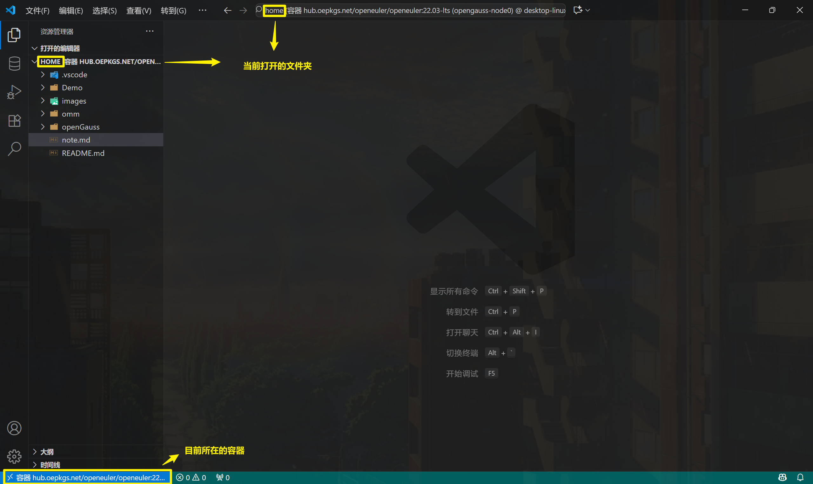
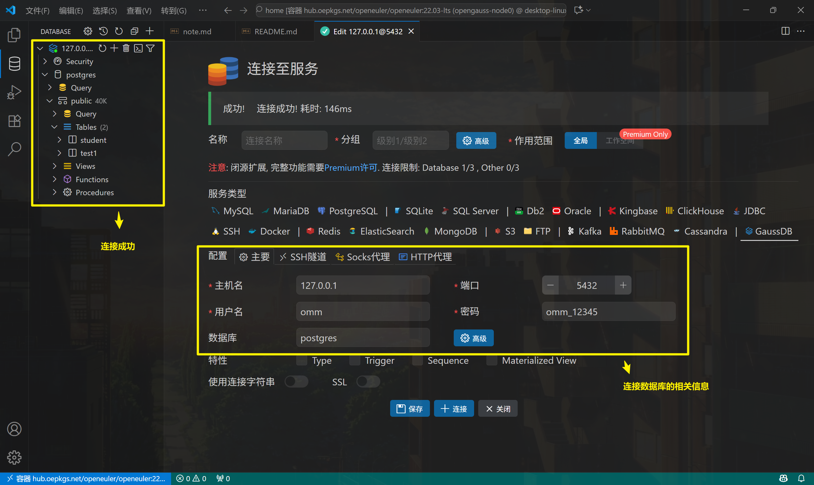

# openGuass 使用说明

## 宿主机相关准备

1. [安装 docker](https://blog.csdn.net/Cike___/article/details/146415836)，每次连接 docker 容器前**务必确保 Docker Desktop 已启动**。
    

2. 安装 [VS Code](https://code.visualstudio.com/)，并安装相关插件：
    
    > 具体使用方法参考：[在 VS Code 中使用 docker](https://zhuanlan.zhihu.com/p/496213879)。

## 使用方法

### 创建 Docker 容器

1. 在宿主机上拉取镜像，[镜像仓库地址](https://hub.docker.com/repository/docker/xcg0/opengauss-openeuler_22.03/general)：

    ```bash
    # 使用 Windows 版本
    docker pull xcg0/opengauss-openeuler_22.03:x86_64

    # 使用 macOS 版本
    docker pull xcg0/opengauss-openeuler_22.03:aarch64
    ```

2. 在宿主机上启动容器（注意替换 `--name` 与 `--hostname` 参数）：

    ```powershell
    # Windows PowerShell
    docker run -itd --name opengauss-node0 `
      --hostname node0 `
      --privileged=true `
      -p 127.0.0.1:5432:5432 `
      -v ${PWD}/init-container.sh:/init-container.sh:ro `
      xcg0/opengauss-openeuler_22.03:x86_64 `
      bash /init-container.sh

    # macOS / Linux
    docker run -itd --name opengauss-node0 \
      --hostname node0 \
      --privileged=true \
      -p 127.0.0.1:5432:5432 \
      -v $(pwd)/init-container.sh:/init-container.sh:ro \
      xcg0/opengauss-openeuler_22.03:aarch64 \
      bash /init-container.sh
    ```

3. 使用 VS Code 连接容器，进入 `\home` 目录。
    
    > **注意**：创建容器时会使用 init-container.sh 脚本在 `\home` 初始化 Git 仓库并拉取代码。如果不想继续跟踪后续代码，请删除 `/home/.git` 目录。
    
    
    
    > 在容器中的 root 用户下运行 `code ‘文件夹路径或文件路径’` 可以直接在 VSCode 中打开。

    `\home` 目录结构（文件夹）如下，其中 **`\omm` 和 `\openGauss` 目录为数据库相关文件，由于体积较大，未包含在 Git 仓库中**：

    ```
    home
    ├── .vscode          # VS Code 编译配置文件
    ├── docs             # 组会演示文档 
    ├── images
    ├── openGauss
    │     ├──openGauss-server # openGauss 数据库
    │     └──binarylibs       # 第三方依赖库
    └── omm
        ├── data          # 数据库数据文件
        └── log           # 数据库日志文件
    ```

### 数据库启动

操作数据库时，**务必使用 `omm` 用户身份**（执行 `su omm` 切换用户）。


1. 启动数据库（单节点）

    ```bash
    gs_ctl start -D /home/omm/data -Z single_node -l /home/omm/log/opengauss.log
    ```

    > 正常启动输出如下：
    > 
    > ```
    > [2025-10-22 13:16:44.405][1532773][][gs_ctl]: gs_ctl started,datadir is /home/omm/data 
    > [2025-10-22 13:16:44.572][1532773][][gs_ctl]: waiting for server to start...
    > .
    > [2025-10-22 13:16:46.570][1532773][][gs_ctl]:  done
    > [2025-10-22 13:16:46.570][1532773][][gs_ctl]: server started (/home/omm/data)
    > ```


2. 查询数据库状态

    ```bash
    gs_ctl query -D /home/omm/data
    ```

    > 状态正常时输出如下：
    > 
    > ```
    > [2025-10-22 13:17:42.333][1533927][][gs_ctl]: gs_ctl query ,datadir is /home/omm/data 
    >  HA state:           
    >         local_role                     : Normal
    >         static_connections             : 0
    >         db_state                       : Normal
    >         detail_information             : Normal
    > 
    >  Senders info:       
    > No information 
    >  Receiver info:      
    > No information 
    > ```

3. 关闭数据库

    ```bash
    gs_ctl stop -D /home/omm/data
    ```

    > 正常关闭时输出如下：
    > 
    > ```
    > [2025-10-22 13:16:08.621][1531932][][gs_ctl]: gs_ctl stopped ,datadir is /home/omm/data 
    > waiting for server to shut down...... done
    > server stopped
    > ```

4. 使用 VSCode PostgreSQL 插件连接数据库：

    在 PostgreSQL 插件中创建连接，连接类型选择 `PostgreSQL`，填写连接信息，保存并连接。

    

    > 需要先启动数据库 `gs_ctl start ……`，才能连接成功。

### 在 VS Code 中调试 openGauss 数据库内核

#### 在 VS Code 中启动调试

- 按 `F5` 选择"附加到 gaussdb 进程（内核调试）"
- 在进程列表中选择目标进程（这一步可能需要十几秒左右加载进程列表）
- 设置断点并执行 SQL 触发


#### 查询执行流程调试示例

以 `exec_simple_query` 断点为例。监视变量：
1. `query_string`：当前执行的 SQL 语句
2. `parsetree_list`：解析后的语法树列表
3. `dest`：结果发送目标

完整命令流程，[详细说明](./exec_simple_query.md)：

| 序号 | 终端1 (GDB) | 终端2 (gsql) | 命令 | 简单说明 |
|------:|:-------------:|:--------------:|:------:|:----|
| 1 | 🔴 |&nbsp;| `gdb -p 1148` | 附加到主进程(PID 从 4.2 步骤获得) |
| 2 | 🔴 |&nbsp;| `handle SIGUSR1 nostop noprint pass` | 忽略 SIGUSR1 信号(避免调试中断) |
| 3 | 🔴 |&nbsp;| `handle SIGUSR2 nostop noprint pass` | 忽略 SIGUSR2 信号(避免调试中断) |
| 4 | 🔴 |&nbsp;| `handle SIGPIPE nostop noprint pass` | 忽略 SIGPIPE 信号(客户端断开连接) |
| 5 | 🔴 |&nbsp;| `handle SIGCHLD nostop noprint pass` | 忽略 SIGCHLD 信号(子进程状态变化) |
| 6 | 🔴 |&nbsp;| `break exec_simple_query` | 在 SQL 执行入口函数设置断点 |
| 7 | 🔴 |&nbsp;| `continue` | 继续执行,等待断点触发 |
| 8 |&nbsp;| 🟡 | `gsql -d postgres` | 连接到 postgres 数据库 |
| 9 |&nbsp;| 🟡 | `SELECT 1;` | 执行 SQL(触发 GDB 断点) |
| 10 | 🔴 |&nbsp;| `list` | 显示当前断点处的源代码 |
| 11 | 🔴 |&nbsp;| `print query_string` | 打印当前执行的 SQL 语句 |
| 12 | 🔴 |&nbsp;| `backtrace` | 显示完整调用栈(函数调用链) |
| 13 | 🔴 |&nbsp;| `next` | 单步执行(跳过函数) |
| 14 | 🔴 |&nbsp;| `next` | 继续单步执行(观察流程) |
| 15 | 🔴 |&nbsp;| `step` | 单步进入函数内部 |
| 16 | 🔴 |&nbsp;| `info locals` | 显示所有局部变量 |
| 17 | 🔴 |&nbsp;| `continue` | 继续执行到下一个断点或结束 |
| 18 |&nbsp;| 🟡 | (查看 SQL 执行结果) | 终端显示查询结果: `?column? = 1` |
| 19 | 🔴 |&nbsp;| `quit` → `y` | 退出 GDB,选择 `y` 确认分离进程 |
| 20 |&nbsp;| 🟡 | `\q` | 退出 gsql 客户端 |

> VS Code 调试界面中也可以完成上述 GDB 命令操作，终端 1 可以使用 VS Code 调试界面，终端 2 使用 VS Code 内置终端即可。
>
> 
