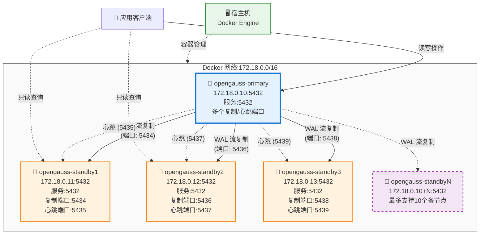

# openGauss 使用说明

## 宿主机相关准备

1. [安装 docker](https://www.docker.com/get-started)，每次连接 docker 容器前**务必确保 Docker Desktop 已启动**。

2. 安装 [git](https://git-scm.com/downloads)，用于克隆代码仓库。

3. 安装 [VS Code](https://code.visualstudio.com/)，并安装相关插件：
    > 具体使用方法参考：[在 VS Code 中使用 docker](https://zhuanlan.zhihu.com/p/496213879)。

4. 在宿主机上拉取镜像，[镜像仓库地址](https://hub.docker.com/repository/docker/xcg0/opengauss-openeuler_22.03/general)：

    ```bash
    # x86_64 架构
    docker pull xcg0/opengauss-openeuler_22.03:x86_64
    ```

> - 单节点部署请参考：[单节点快速部署指南](./docs//single-node/README.md)
> - openGauss 数据库内核调试请参考：[openGauss 数据库内核调试指南](./docs/debug.md) 


## 多节点集群部署


```mermaid
graph TB
    subgraph Network["Docker 网络:172.18.0.0/16"]
        Primary["🔷 opengauss-primary<br/>172.18.0.10:5432<br/>服务:5432<br/>多个复制/心跳端口"]
        
        Standby1["🔶 opengauss-standby1<br/>172.18.0.11:5432<br/>服务:5432<br/>复制端口:5434<br/>心跳端口:5435"]
        Standby2["🔶 opengauss-standby2<br/>172.18.0.12:5432<br/>服务:5432<br/>复制端口:5436<br/>心跳端口:5437"]
        Standby3["🔶 opengauss-standby3<br/>172.18.0.13:5432<br/>服务:5432<br/>复制端口:5438<br/>心跳端口:5439"]
        StandbyN["🔶 opengauss-standbyN<br/>172.18.0.10+N:5432<br/>最多支持10个备节点"]
        
        %% WAL 流复制（使用 replication connection）
        Primary -->|"WAL 流复制<br/>(端口: 5434)"| Standby1
        Primary -->|"WAL 流复制<br/>(端口: 5436)"| Standby2
        Primary -->|"WAL 流复制<br/>(端口: 5438)"| Standby3
        Primary -.->|"WAL 流复制"| StandbyN
        
        %% 心跳连接（独立端口）
        Primary -.->|"心跳 (5435)"| Standby1
        Primary -.->|"心跳 (5437)"| Standby2
        Primary -.->|"心跳 (5439)"| Standby3
    end

    Host["🖥️ 宿主机<br/>Docker Engine"] -.->|"容器管理"| Network
    Client["📱 应用客户端"] -->|"读写操作"| Primary
    Client -.->|"只读查询"| Standby1
    Client -.->|"只读查询"| Standby2

    style Primary fill:#e3f2fd,stroke:#1976d2,stroke-width:3px
    style Standby1 fill:#fff3e0,stroke:#f57c00,stroke-width:2px
    style Standby2 fill:#fff3e0,stroke:#f57c00,stroke-width:2px
    style Standby3 fill:#fff3e0,stroke:#f57c00,stroke-width:2px
    style StandbyN fill:#f3e5f5,stroke:#9c27b0,stroke-width:2px,stroke-dasharray: 5 5
    style Network fill:#fafafa,stroke:#424242,stroke-width:1px
    style Host fill:#e8f5e9,stroke:#388e3c,stroke-width:2px
```

> - 更详细的多节点集群部署文档请参考：[脚本详细说明](scripts/multi-node/README.md)
> - 目前仅支持基于流复制（Streaming Replication）的主备部署，后续如果支持 DCF 模式（使用 Paxos 共识算法）会同步更新文档。详细对比请参考：[DCF vs 流复制](./DCF_vs_StreamingReplication.md)

### 快速开始

使用一键部署脚本 `multi-node.sh` 进行多节点集群部署。`-h` 参数可以查看帮助信息：

```bash
openGauss 多节点集群一键部署脚本

用法: scripts/multi-node.sh [选项]

选项:
    -n NUMBER   备节点数量 (1-10)，默认: 2
    -m MODE     复制模式，默认: ANY1
    -y          所有步骤自动确认，不提示
    -h          显示帮助

示例:
    scripts/multi-node.sh -m SYNC           # 1主2备，SYNC模式，每步确认
    scripts/multi-node.sh -m ASYNC -y       # 1主2备，ASYNC模式，自动执行
    scripts/multi-node.sh -n 2 -m ANY1      # 1主2备，ANY1模式，每步确认（默认）
    scripts/multi-node.sh -n 4 -m ANY2 -y   # 1主4备，ANY2模式，自动执行
    scripts/multi-node.sh -n 3 -m FIRST2    # 1主3备，FIRST2模式，每步确认
```

| 参数 | 说明 | 默认值 | 示例 |
|------|------|--------|------|
| `-n NUMBER` | 备节点数量 (1-10) | 2 | `-n 4` (1主4备) |
| `-m MODE` | 复制模式 | ANY1 | `-m ANY2` (任意2个同步) |
| `-y` | 自动确认所有步骤 | 手动确认 | `-y` (无交互模式) |
| `-h` | 显示帮助信息 | - | `-h` |

> `-m` 可选的复制模式包括：
> - `ANYN`：任意 N 个备库为同步，其他为异步
> - `FIRSTN`：前 N 个备库为同步，其他为异步
> - `SYNC`：任意 N 个备库为同步，其他为异
> - `ASYNC`：所有备库均为异步


如果需要更精细的控制或故障排查，可以手动执行各个步骤：

```bash
# 在 scripts 目录执行
cd scripts/multi-node

./01_create_containers.sh -n 4 # 步骤1: 创建容器 (必需)
./02_setup_ssh.sh # 步骤2: 配置SSH (可选，但建议执行)
./03_init_cluster.sh -m ANY2  # 步骤3: 初始化集群 (必需)
./04_start_cluster.sh # 步骤4: 启动集群 (必需)
./05_verify_cluster.sh # 步骤5: 验证集群 (建议)
```

> 容器初始化时默认使用 GitHub 作为[代码仓库](https://github.com/XCG0/HIT-HATM)，如遇网络问题会切换到 [Gitee 镜像仓库](https://gitee.com/XuChGu/HIT-HATM)。

#### 常用管理命令

```bash
# 查看集群状态
docker exec opengauss-primary su - omm -c "gs_ctl query -D /home/omm/data"

# 启动集群
./scripts/multi-node/04_start_cluster.sh

# 停止集群
./scripts/multi-node/06_stop_cluster.sh

# 清理环境
docker stop $(docker ps -q -f name=opengauss)
docker rm $(docker ps -aq -f name=opengauss)
docker network rm opengauss-network
```

#### 高级配置

```bash
# 修改主节点配置以提升性能
docker exec opengauss-primary su - omm -c "
    gsql -d postgres -c \"
        ALTER SYSTEM SET shared_buffers = '1GB';
        ALTER SYSTEM SET max_connections = 500;
        ALTER SYSTEM SET wal_buffers = '64MB';
        SELECT pg_reload_conf();
    \"
"
```

