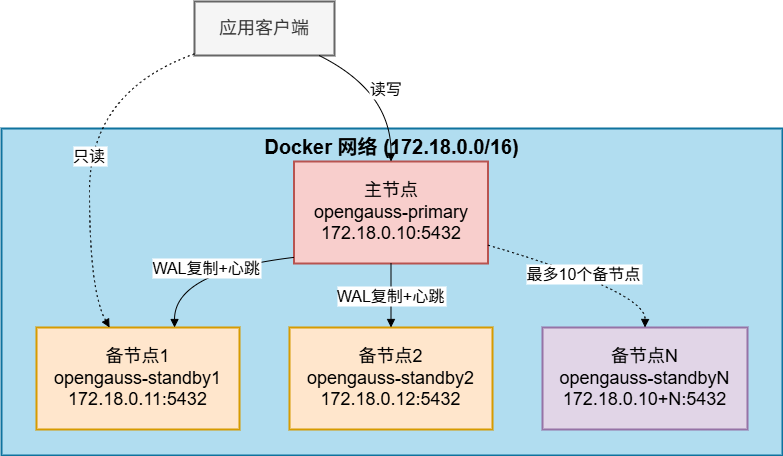
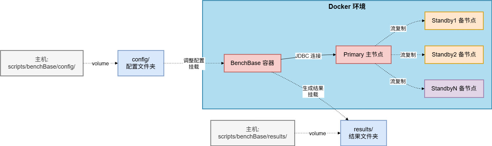

# openGauss 使用说明

## 1. 宿主机相关准备

1. [安装 docker](https://www.docker.com/get-started)，每次连接 docker 容器前**务必确保 Docker Desktop 已启动**。
2. 安装 [git](https://git-scm.com/downloads)，用于克隆代码仓库，**后续命令请使用 bash 完成**（一般来说 git 会自动安装 bash）。
3. 安装 [VS Code](https://code.visualstudio.com/)，并安装相关插件：

   

   > 具体使用方法参考：[在 VS Code 中使用 docker](https://zhuanlan.zhihu.com/p/496213879)。
   >
4. 在宿主机上拉取镜像，[opengauss镜像](https://hub.docker.com/repository/docker/xcg0/opengauss-openeuler_22.03/general)、[benchbase镜像](https://hub.docker.com/repository/docker/xcg0/benchbase-opengauss/general)：

   ```bash
   # opengauss 单节点数据库
   docker pull xcg0/opengauss-openeuler_22.03:x86_64

   # benchbase postgre
   docker pull xcg0/benchbase-opengauss:latest
   ```

   > 单节点部署请参考：[单节点快速部署指南](./docs/single-node.md)
   >
   > openGauss 数据库内核调试请参考：[openGauss 数据库内核调试指南
   > ](./docs/debug.md)
   >

---

## 2. 多节点集群部署

> 更详细的多节点集群部署文档请参考：[多节点部署脚本详细说明](tools/multi-node/README.md)
>
> 目前仅支持基于流复制（Streaming Replication）的主备部署，后续如果支持 DCF 模式（使用 Paxos 共识算法）会同步更新文档。详细对比请参考：[DCF vs 流复制](./docs/DCF_vs_StreamingReplication.md)

集群架构如下：



### 2.1 快速开始

使用一键部署脚本 `multi-node.sh` 进行多节点集群部署。用法：`./multi-node.sh [-n 备节点数] [-m 复制模式] [-s 仅执行某一步骤] [-y 所有步骤自动确认]`

```bash
cd scripts

./multi-node.sh -h  # 显示帮助信息

#./multi-node.sh     # 1主2备，ANY1模式，全部执行，每步确认（默认）
./multi-node.sh -y  # 1主2备，ANY1模式，全部执行，自动确认
#./multi-node.sh -n 2 -m ANY1 -y # 同上

```

| 参数          | 说明              | 默认值   | 示例                      |
| ------------- | ----------------- | -------- | ------------------------- |
| `-n NUMBER` | 备节点数量 (1-10) | 2        | `-n 4` (1主4备)         |
| `-m MODE`   | 复制模式          | ANY1     | `-m ANY2` (任意2个同步) |
| `-y`        | 自动确认所有步骤  | 手动确认 | `-y` (无交互模式)       |
| `-h`        | 显示帮助信息      | -        | `-h`                    |
| `-s`        | 执行特定某个步骤  | 全部步骤 | `-s start`、`-s 4`    |

> `-m` 可选的复制模式包括：
>
> - `ANYN`：任意 N 个备库为同步，其他为异步
> - `FIRSTN`：前 N 个备库为同步，其他为异步
> - `SYNC`：任意 N 个备库为同步，其他为异
> - `ASYNC`：所有备库均为异步
>
> `-s` 可选步骤有 `1 或 create`、`2 或 ssh`、``3 或 init``、`4 或 start`、`5 或 verify`、`stop `、`restart`

执行流程图：


> 01 ~ 05 脚本均位于 `scripts/multi-node/` 目录下。
>
> `01_create_containers.sh` 在容器初始化时默认使用 [Github 代码仓库](https://github.com/XCG0/HIT-HATM)，如遇网络问题会切换到 [Gitee 镜像仓库](https://gitee.com/XuChGu/HIT-HATM)。

### 2.2 常用管理命令

```bash
# 查看集群状态
docker exec opengauss-primary su - omm -c "gs_ctl query -D /home/omm/data"

# 启动集群
./scripts/multi-node.sh -s start

# 停止集群
./scripts/multi-node.sh -s stop

# 清理环境
docker stop $(docker ps -q -f name=opengauss)
docker rm $(docker ps -aq -f name=opengauss)
docker network rm opengauss-network
```

---

## 3. BenchBase 基准测试工具使用说明

> 详细文档请参考：[BenchBase 使用指南](tools/benchBase/README.md)

BenchBase（原 OLTP-Bench）是 CMU 数据库组开发的**多数据库 SQL 基准测试框架**，通过 JDBC 连接支持多种关系型数据库。

测试架构如下：



### 3.1 支持的基准测试

| 基准测试               | 类型      | 应用场景     | 说明                             |
| ---------------------- | --------- | ------------ | -------------------------------- |
| **TPC-C**        | OLTP      | 订单处理系统 | 批发供应商业务，测试事务处理能力 |
| **SmallBank**    | OLTP      | 银行应用     | 简单银行交易，轻量级测试         |
| **YCSB**         | Key-Value | 云服务基准   | 简单读写操作，测试扩展性         |
| **TATP**         | OLTP      | 电信应用     | 高并发简单事务                   |
| **TPC-H**        | OLAP      | 决策支持系统 | 复杂分析查询                     |
| **Wikipedia**    | Web应用   | 维基百科     | 真实Web访问模式                  |
| **CH-benCHmark** | HTAP      | 混合负载     | OLTP和OLAP混合测试               |

### 3.2 快速开始

```bash
cd scripts

# 运行 TPC-C 测试（默认）
./benchBase.sh

# 运行其它测试
./benchBase.sh -t smallbank
./benchBase.sh -t ycsb
./benchBase.sh -t tpch
./benchBase.sh -t tatp
./benchBase.sh -t wikipedia
./benchBase.sh -t chbenchmark
```

执行流程说明：


> 01 ~ 05 脚本均位于 `scripts/benchBase/` 目录下。

### 3.3 配置文件

所有配置文件位于 `tools/benchBase/config/` 目录，`tools/benchBase/config/postgres/` 下有针对 PostgreSQL 的官方示例配置：

```bash
# 从模板创建其他基准测试配置（以 tpcc 为例，注意已经配置过了）
cp config/postgres/sample_tpcc_config.xml config/tpcc_config.xml
```

> 注意从模板创建配置文件后修改下面几行：
>
> ```xml
> <!-- 数据库: benchbase_db, 用户: benchbase, 密码: benchbase@123 (MD5加密) -->
> <url>jdbc:postgresql://172.18.0.10:5432/benchbase_db?…………</url>
> <username>benchbase</username>
> <password>benchbase@123</password>
> ```

### 3.4 测试结果

测试结果保存在 `tools/benchBase/results/` 目录，以“测试名+日期”为名的子文件夹中：

```bash
# 查看自动生成的文本报告
cat tools/benchBase/results/<测试名+日期>/tpcc_result.txt

# 查看 JSON 格式详细结果
cat tools/benchBase/results/<测试名+日期>/tpcc_*.summary.json

# 查看所有结果文件
ls -lh tools/benchBase/results/<测试名+日期>/
```

**关键性能指标**：

- **Throughput (tpmC)** - 每分钟事务数（TPC-C 核心指标）
- **P50/P95/P99 Latency** - 延迟百分位数
- **Goodput** - 有效吞吐量

# 常见问题

## 1. Windows 换行符

- **问题描述**：`'\r':command not found`
- **解决方法**：`find.-name"*.sh"-execsed-i's/\r$//'{}\;`，将 Windows 的 CRLF (`\r\n`) 换行符转为 Linux/WSL 需要的 LF (`\n`)。
