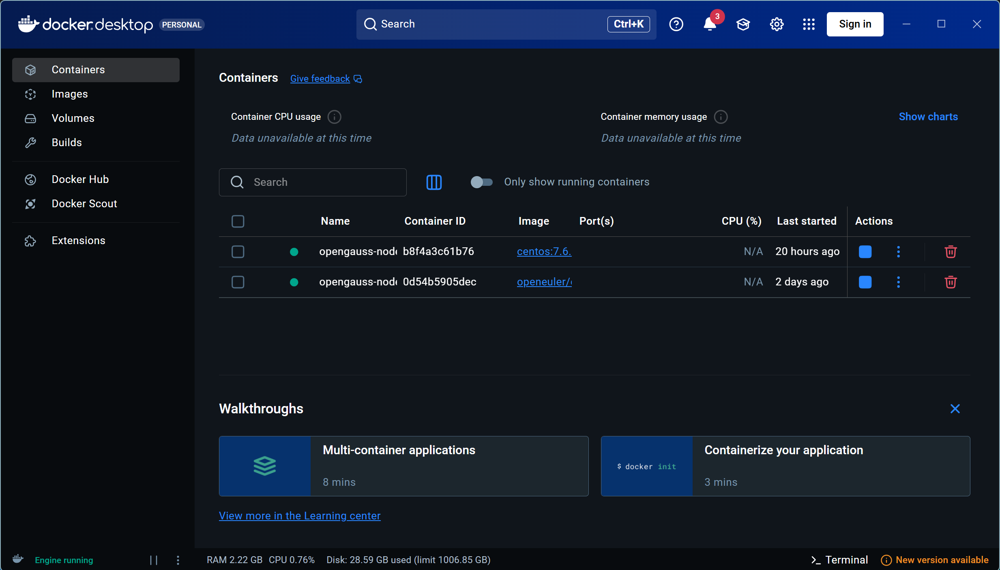
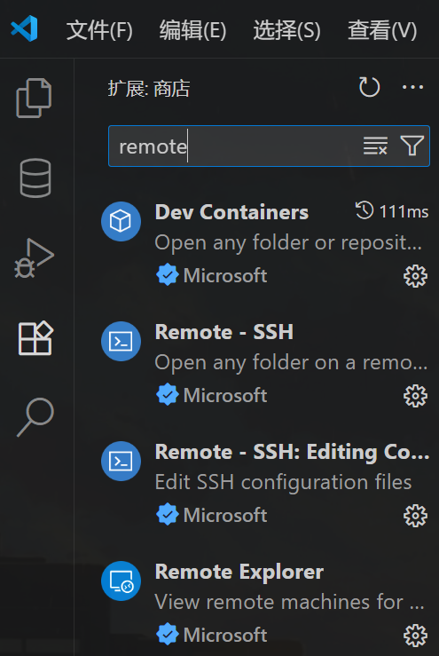
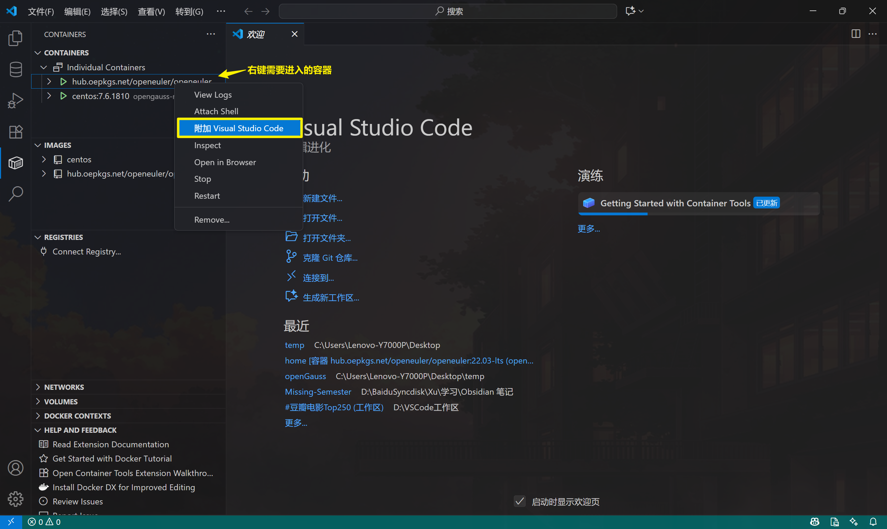
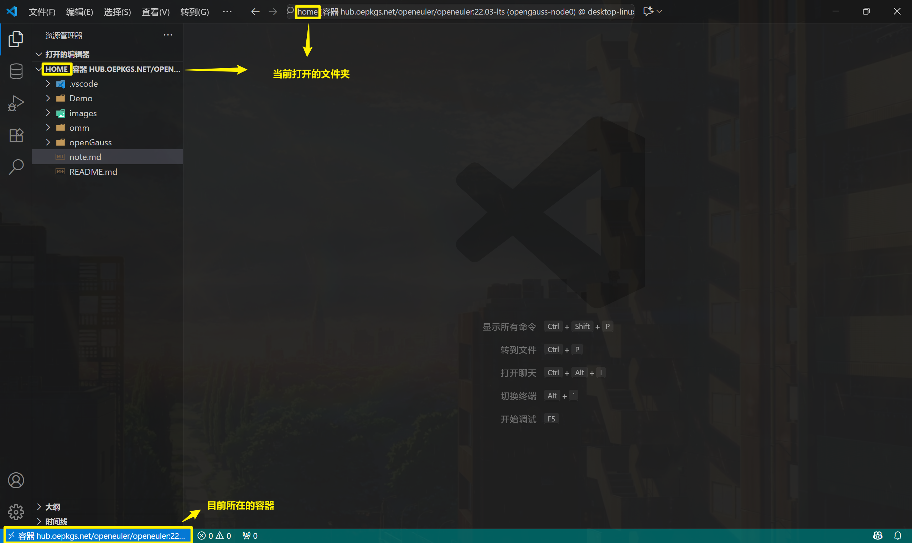
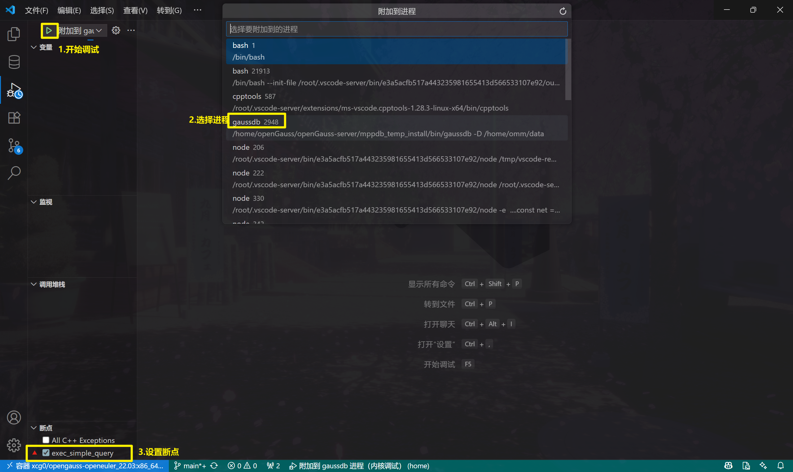
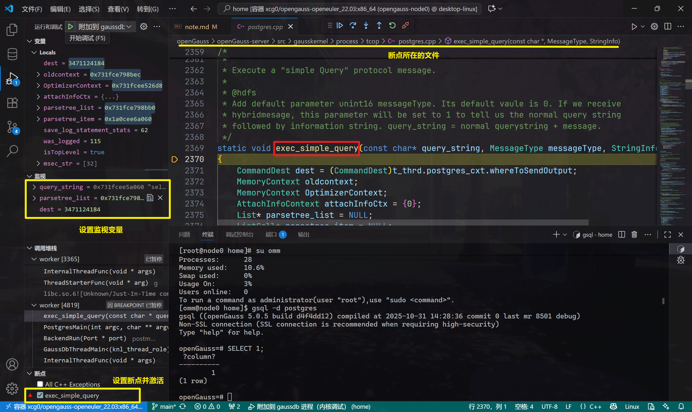
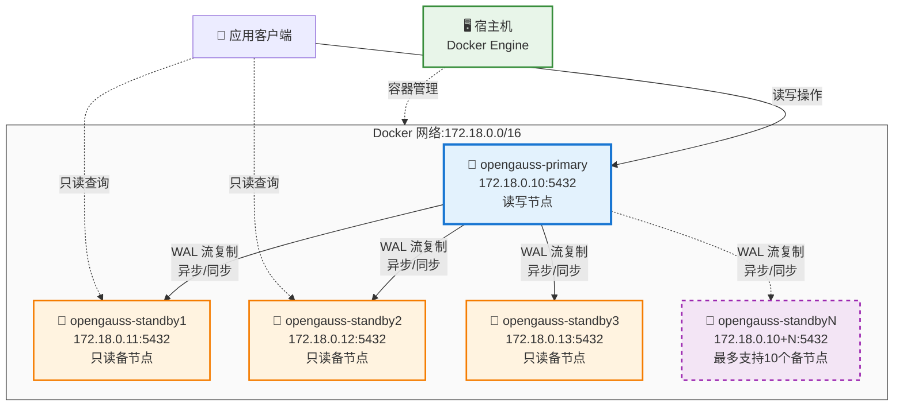

# openGauss 使用说明

> **📌 新增：[多节点集群部署指南](#多节点集群部署)** - 一主多备高可用集群快速部署，支持一键自动部署

## 目录

- [单节点部署](#单节点部署)
  - [宿主机相关准备](#宿主机相关准备)
  - [创建 Docker 容器](#创建-docker-容器)
  - [数据库启动](#数据库启动)
  - [在 VS Code 中调试 openGauss 数据库内核](#在-vs-code-中调试-opengauss-数据库内核)
- [多节点集群部署](#多节点集群部署)
  - [快速开始](#快速开始)
  - [详细配置](#详细配置)

---

## 单节点部署

### 宿主机相关准备

1. [安装 docker](https://blog.csdn.net/Cike___/article/details/146415836)，每次连接 docker 容器前**务必确保 Docker Desktop 已启动**。
    

2. 安装 [VS Code](https://code.visualstudio.com/)，并安装相关插件：
    
    > 具体使用方法参考：[在 VS Code 中使用 docker](https://zhuanlan.zhihu.com/p/496213879)。

## 使用方法

### 创建 Docker 容器

1. 在宿主机上拉取镜像，[镜像仓库地址](https://hub.docker.com/repository/docker/xcg0/opengauss-openeuler_22.03/general)：

    ```bash
    # 使用 Windows 版本
    docker pull xcg0/opengauss-openeuler_22.03:x86_64

    # 使用 macOS 版本
    docker pull xcg0/opengauss-openeuler_22.03:aarch64
    ```

2. 在宿主机上启动容器（注意替换 `--name` 与 `--hostname` 参数）：

    ```powershell
    # Windows PowerShell
    docker run -itd --name opengauss-node0 `
      --hostname node0 `
      --privileged=true `
      -p 127.0.0.1:5432:5432 `
      -v ${PWD}/init-container.sh:/init-container.sh:ro `
      xcg0/opengauss-openeuler_22.03:x86_64 `
      bash /init-container.sh

    # macOS / Linux
    docker run -itd --name opengauss-node0 \
      --hostname node0 \
      --privileged=true \
      -p 127.0.0.1:5432:5432 \
      -v $(pwd)/init-container.sh:/init-container.sh:ro \
      xcg0/opengauss-openeuler_22.03:aarch64 \
      bash /init-container.sh
    ```

3. 使用 VS Code 连接容器，进入 `\home` 目录。
    
    > **注意**：创建容器时会使用 [init-container.sh](../../init-container.sh) 脚本在 `\home` 初始化 Git 仓库并拉取代码。如果不想继续跟踪后续代码，请删除 `/home/.git` 目录。
    
    
    
    > 在容器中的 root 用户下运行 `code ‘文件夹路径或文件路径’` 可以直接在 VSCode 中打开。

    `\home` 目录结构（文件夹）如下，其中 **`\omm` 和 `\openGauss` 目录为数据库相关文件，由于体积较大，未包含在 Git 仓库中**：

    ```
    home
    ├── .vscode          # VS Code 编译配置文件
    ├── docs             # 组会演示文档 
    ├── images
    ├── openGauss
    │     ├──openGauss-server # openGauss 数据库
    │     └──binarylibs       # 第三方依赖库
    └── omm
        ├── data          # 数据库数据文件
        └── log           # 数据库日志文件
    ```

### 数据库启动

操作数据库时，**务必使用 `omm` 用户身份**（执行 `su omm` 切换用户）。


1. 启动数据库（单节点）

    ```bash
    gs_ctl start -D /home/omm/data -Z single_node -l /home/omm/log/opengauss.log
    ```

2. 查询数据库状态

    ```bash
    gs_ctl query -D /home/omm/data
    ```

3. 关闭数据库

    ```bash
    gs_ctl stop -D /home/omm/data
    ```

### 在 VS Code 中调试 openGauss 数据库内核

#### 在 VS Code 中启动调试

- 按 `F5` 选择"附加到 gaussdb 进程（内核调试）"
- 在进程列表中选择目标进程（这一步可能需要十几秒左右加载进程列表）
- 设置断点并执行 SQL 触发




#### 常用调试场景

> 可以点击链接跳转到断点所对应的代码位置。

| 场景 | 关键断点 | 调试目标 | 示例 SQL |
|------|---------|---------|---------|
| **1. 查询执行流程** | [`exec_simple_query()`](openGauss/openGauss-server/src/gausskernel/process/tcop/postgres.cpp#L2369)<br>[`pg_parse_query()`](openGauss/openGauss-server/src/gausskernel/process/tcop/postgres.cpp#L1010)<br>[`pg_plan_queries()`](openGauss/openGauss-server/src/gausskernel/process/tcop/postgres.cpp#L1485)<br>[`ExecutorRun()`](openGauss/openGauss-server/src/gausskernel/runtime/executor/execMain.cpp#L444) | SQL 解析→优化→执行完整流程 | `INSERT INTO test VALUES (1, 'x');`<br>`SELECT * FROM test;` |
| **2. 事务和 MVCC** | [`StartTransaction()`](openGauss/openGauss-server/src/gausskernel/storage/access/transam/xact.cpp#L2307)<br>[`GetTransactionSnapshot()`](openGauss/openGauss-server/src/common/backend/utils/time/snapmgr.cpp#L479)<br>[`HeapTupleSatisfiesMVCC()`](openGauss/openGauss-server/src/gausskernel/storage/access/heap/heapam_visibility.cpp#L1026)<br>[`CommitTransaction()`](openGauss/openGauss-server/src/gausskernel/storage/access/transam/xact.cpp#L2583) | 快照隔离、可见性判断 | 两会话并发读写同一行 |
| **3. 锁机制** | [`LockAcquire()`](openGauss/openGauss-server/src/gausskernel/storage/lmgr/lock.cpp#L533)<br>[`LockRelease()`](openGauss/openGauss-server/src/gausskernel/storage/lmgr/lock.cpp#L1860)<br>[`DeadLockCheck()`](openGauss/openGauss-server/src/gausskernel/storage/lmgr/deadlock.cpp#L191)<br>[`ProcSleep()`](openGauss/openGauss-server/src/gausskernel/storage/lmgr/proc.cpp#L1748) | 锁冲突、死锁检测 | 两会话交叉更新不同行 |
| **4. 缓冲区管理** | [`ReadBuffer()`](openGauss/openGauss-server/src/gausskernel/storage/buffer/bufmgr.cpp#L1632)<br>[`BufferAlloc()`](openGauss/openGauss-server/src/gausskernel/storage/buffer/bufmgr.cpp#L354)<br>[`FlushBuffer()`](openGauss/openGauss-server/src/gausskernel/storage/buffer/bufmgr.cpp#L4664)<br>[`StrategyGetBuffer()`](openGauss/openGauss-server/src/gausskernel/storage/buffer/freelist.cpp#L180) | 页面读取、缓冲区替换策略 | 大表全表扫描 |
| **5. 索引操作** | [`_bt_search()`](openGauss/openGauss-server/src/gausskernel/storage/access/nbtree/nbtsearch.cpp#L60)<br>[`_bt_split()`](openGauss/openGauss-server/src/gausskernel/storage/access/nbtree/nbtinsert.cpp#L74) | B-Tree 查找/分裂 | `CREATE INDEX`<br>索引查询 |
| **6. WAL 和恢复** | [`XLogInsert()`](openGauss/openGauss-server/src/gausskernel/storage/access/transam/xloginsert.cpp#L505)<br>[`StartupXLOG()`](openGauss/openGauss-server/src/gausskernel/storage/access/transam/xlog.cpp#L8741) | 日志写入、崩溃恢复 | 模拟崩溃后重启 |
| **7. 并发控制** | [`heap_hot_search()`](openGauss/openGauss-server/src/gausskernel/storage/access/heap/heapam.cpp#L2600)<br>[`heap_page_prune()`](openGauss/openGauss-server/src/gausskernel/storage/access/heap/pruneheap.cpp#L173)<br>[`vacuum_rel()`](openGauss/openGauss-server/src/gausskernel/optimizer/commands/vacuum.cpp#L130) | HOT 更新、页面清理 | 频繁更新同一页数据 |
| **8. 优化器决策** | [`planner()`](openGauss/openGauss-server/src/gausskernel/optimizer/plan/planner.cpp#L370)<br>[`create_plan()`](openGauss/openGauss-server/src/gausskernel/optimizer/plan/createplan.cpp#L302)<br>[`cost_seqscan()`](openGauss/openGauss-server/src/gausskernel/optimizer/path/costsize.cpp#L640)<br>[`cost_index()`](openGauss/openGauss-server/src/gausskernel/optimizer/path/costsize.cpp#L976) | 执行计划生成、代价估算 | `EXPLAIN` 对比不同查询计划 |
| **9. 内存管理** | [`MemoryContextReset()`](openGauss/openGauss-server/src/common/backend/utils/mmgr/mcxt.cpp#L215)<br>[`MemoryContextDelete()`](openGauss/openGauss-server/src/common/backend/utils/mmgr/mcxt.cpp#L364) | 内存分配与释放 | 执行复杂查询观察内存 |
| **10. 扩展功能** | [`ExecCallTriggerFunc()`](openGauss/openGauss-server/src/gausskernel/optimizer/commands/trigger.cpp#L96)<br>[`exec_stmt_execsql()`](openGauss/openGauss-server/src/common/pl/plpgsql/src/pl_exec.cpp#L144)<br>[`fmgr_info()`](openGauss/openGauss-server/src/common/backend/utils/fmgr/fmgr.cpp#L246) | 触发器、存储过程执行 | 创建并触发触发器 |

#### 查询执行流程调试示例

以 `exec_simple_query` 断点为例。监视变量：
1. `query_string`：当前执行的 SQL 语句
2. `parsetree_list`：解析后的语法树列表

调试步骤如下表所示：

| 序号 | 终端1 (GDB) | 终端2 (gsql) | 命令 | 简单说明 |
|------:|:-------------:|:--------------:|:------:|:----|
| 1 | 🔴 |&nbsp;| `gdb -p 1148` | 附加到主进程(PID 从 4.2 步骤获得) |
| 2 | 🔴 |&nbsp;| `handle SIGUSR1 nostop noprint pass` | 忽略 SIGUSR1 信号(避免调试中断) |
| 3 | 🔴 |&nbsp;| `break exec_simple_query` | 在 SQL 执行入口函数设置断点 |
| 4 | 🔴 |&nbsp;| `continue` | 继续执行,等待断点触发 |
| 5 |&nbsp;| 🟡 | `gsql -d postgres` | 连接到 postgres 数据库 |
| 6 |&nbsp;| 🟡 | `SELECT 1;` | 执行 SQL(触发 GDB 断点) |
| 7 | 🔴 |&nbsp;| `list` | 显示当前断点处的源代码 |
| 8 | 🔴 |&nbsp;| `print query_string` | 打印当前执行的 SQL 语句 |
| 9 | 🔴 |&nbsp;| `backtrace` | 显示完整调用栈(函数调用链) |
| 10 | 🔴 |&nbsp;| `next` | 单步执行(跳过函数) |
| 11 | 🔴 |&nbsp;| `step` | 单步进入函数内部 |
| 12 | 🔴 |&nbsp;| `info locals` | 显示所有局部变量 |
| 13 | 🔴 |&nbsp;| `continue` | 继续执行到下一个断点或结束 |
| 14 |&nbsp;| 🟡 | (查看 SQL 执行结果) | 终端显示查询结果: `?column? = 1` |
| 15 | 🔴 |&nbsp;| `quit` → `y` | 退出 GDB,选择 `y` 确认分离进程 |
| 16 |&nbsp;| 🟡 | `\q` | 退出 gsql 客户端 |

> 注意终端返回了执行结果后再执行下一条命令，没返回结果继续 `continue` 即可。
>
> VS Code 调试界面中也可以完成上述 GDB 命令操作，终端 1 可以使用 VS Code 调试界面，终端 2 使用 VS Code 内置终端即可。
>
> 

---

## 多节点集群部署


```mermaid
graph TB
    subgraph Network["Docker 网络:172.18.0.0/16"]
        Primary["🔷 opengauss-primary<br/>172.18.0.10:5432<br/>读写节点"]
        
        Standby1["🔶 opengauss-standby1<br/>172.18.0.11:5432<br/>只读备节点"]
        Standby2["🔶 opengauss-standby2<br/>172.18.0.12:5432<br/>只读备节点"]
        Standby3["🔶 opengauss-standby3<br/>172.18.0.13:5432<br/>只读备节点"]
        StandbyN["🔶 opengauss-standbyN<br/>172.18.0.10+N:5432<br/>最多支持10个备节点"]
        
        Primary -->|"WAL 流复制<br/>异步/同步"| Standby1
        Primary -->|"WAL 流复制<br/>异步/同步"| Standby2
        Primary -->|"WAL 流复制<br/>异步/同步"| Standby3
        Primary -.->|"WAL 流复制<br/>异步/同步"| StandbyN
    end
    
    Host["🖥️ 宿主机<br/>Docker Engine"] -.->|"容器管理"| Network
    Client["📱 应用客户端"] -->|"读写操作"| Primary
    Client -.->|"只读查询"| Standby1
    Client -.->|"只读查询"| Standby2
    
    style Primary fill:#e3f2fd,stroke:#1976d2,stroke-width:3px
    style Standby1 fill:#fff3e0,stroke:#f57c00,stroke-width:2px
    style Standby2 fill:#fff3e0,stroke:#f57c00,stroke-width:2px
    style Standby3 fill:#fff3e0,stroke:#f57c00,stroke-width:2px
    style StandbyN fill:#f3e5f5,stroke:#9c27b0,stroke-width:2px,stroke-dasharray: 5 5
    style Network fill:#fafafa,stroke:#424242,stroke-width:1px
    style Host fill:#e8f5e9,stroke:#388e3c,stroke-width:2px
```

### 快速开始

使用新的一键部署脚本 `multi-node.sh`，只需一条命令即可完成整个集群的自动部署：

```bash
# 在项目根目录执行
cd scripts

# 一键自动部署（1主2备，ANY1模式）
./multi-node.sh -y

# 自定义配置（1主4备，ANY2模式，每步确认）
./multi-node.sh -n 4 -m ANY2

# 查看帮助
./multi-node.sh -h
```

| 参数 | 说明 | 默认值 | 示例 |
|------|------|--------|------|
| `-n NUMBER` | 备节点数量 (1-10) | 2 | `-n 4` (1主4备) |
| `-m MODE` | 复制模式 | ANY1 | `-m ANY2` (任意2个同步) |
| `-y` | 自动确认所有步骤 | 手动确认 | `-y` (无交互模式) |
| `-h` | 显示帮助信息 | - | `-h` |

> `-m` 可选的复制模式包括：
> - `ANYN`：任意 N 个备库为同步，其他为异步
> - `FIRSTN`：前 N 个备库为同步，其他为异步
> - `SYNC`：任意 N 个备库为同步，其他为异
> - `ASYNC`：所有备库均为异步


如果需要更精细的控制或故障排查，可以手动执行各个步骤：

```bash
# 在 scripts 目录执行
cd scripts/multi-node

./01_create_containers.sh -n 4 # 步骤1: 创建容器 (必需)
./02_setup_ssh.sh # 步骤2: 配置SSH (可选，但建议执行)
./03_init_cluster.sh -m ANY2  # 步骤3: 初始化集群 (必需)
./04_start_cluster.sh # 步骤4: 启动集群 (必需)
./05_verify_cluster.sh # 步骤5: 验证集群 (建议)
```

#### 常用管理命令

```bash
# 查看集群状态
docker exec opengauss-primary su - omm -c "gs_ctl query -D /home/omm/data"

# 启动集群
./scripts/multi-node/04_start_cluster.sh

# 停止集群
./scripts/multi-node/06_stop_cluster.sh

# 清理环境
docker stop $(docker ps -q -f name=opengauss)
docker rm $(docker ps -aq -f name=opengauss)
docker network rm opengauss-network
```

#### 高级配置

```bash
# 修改主节点配置以提升性能
docker exec opengauss-primary su - omm -c "
    gsql -d postgres -c \"
        ALTER SYSTEM SET shared_buffers = '1GB';
        ALTER SYSTEM SET max_connections = 500;
        ALTER SYSTEM SET wal_buffers = '64MB';
        SELECT pg_reload_conf();
    \"
"
```

> **📚 更多文档**
> 
> - [脚本详细说明](scripts/multi-node/README.md)
> - [openGauss 官方文档](https://docs.opengauss.org/zh/)
> - [Docker 部署最佳实践](https://docs.docker.com/engine/reference/builder/)

