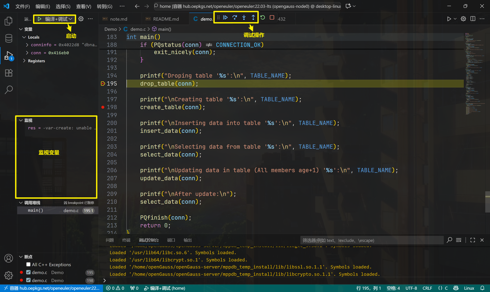
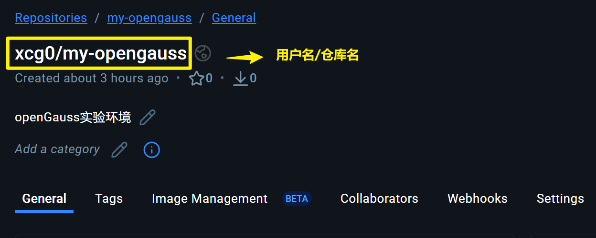

# 工作总结

## 一、构建容器

1. 下载 centos7.6、openEuler 20.03 LTS：

    ```shell
    # 下载 centos7.6 镜像
    docker pull centos:7.6.1810

    # 从 openEuler 官方容器镜像仓库拉取
    docker pull hub.oepkgs.net/openeuler/openeuler:22.03-lts
    ```

2. 使用官方镜像创建并启动容器：

    ```shell
    # 创建并启动 openEuler 20.03 LTS 容器
    docker run -itd --name opengauss-node0 \
        --hostname node0 \
        --privileged=true \
        -p 5432:5432 \
        hub.oepkgs.net/openeuler/openeuler:22.03-lts 

    # 创建并启动 centos7.6 容器
    docker run -itd --name opengauss-node1 \
        --hostname node1 \
        --privileged=true \
        -p 5432:5432 \
        centos:7.6.1810
    ```

    > `--privileged=true`：赋予容器所有的权限，方便编译安装 openGauss 数据库。
    > `-p 5432:5432`：映射容器的 5432 端口到宿主机的 5432 端口，方便通过宿主机连接数据库。

3. 使用 VSCode 连接容器。

    

    

    > 在容器中的 root 用户下运行 `code ‘文件夹路径或文件路径’` 可以直接在 VSCode 中打开。

## 二、单节点编译安装 openGauss 数据库

根据 [参考文档](https://docs.opengauss.org/zh/docs/5.0.0/docs/CompilationGuide/%E6%90%AD%E5%BB%BA%E7%BC%96%E8%AF%91%E7%8E%AF%E5%A2%83.html) 编写安装脚本：

1. [install_deps.sh](./Demo/install/install_deps.sh)：安装依赖包；
2. [build_openGauss.sh](./Demo/install/build_openGauss.sh)：编译安装 openGauss 数据库；
3. [verify_openGauss.sh](./Demo/install/verify_openGauss.sh)：验证 openGauss 数据库是否可用。

## 三、数据库的连接与使用

### 3.1. 使用 gsql 连接数据库（终端）

```shell
# 本地连接数据库
gsql -d postgres -p 5432
# 远程连接数据库
gsql -h 127.0.0.1 -d postgres -p 5432 -U omm -W omm_12345

# 第一次使用数据库，必须修改omm用户密码。
alter role omm identified by ‘新密码’ replace ‘旧密码’;
# omm 用户可以直接修改自己及其他用户密码。
alter user omm with password 'omm_1234';
# 创建新用户
create user test with password 'test_1234';

# --关闭密码修改设置。
gs_guc reload -N all -I all -c "modify_initial_password = false" 

# --退出数据库。
\q
```

### 3.2. 使用 PostgreSQL 插件连接数据库（VSCode）

先根据 3.1 节内容，配置 omm 用户密码。

1. 安装 PostgreSQL 插件；
2. openGauss 默认使用 SCRAM-SHA-256 加密方式，需要修改为 md5：

    ```shell
    SHOW password_encryption_type;

    # 使用 md5 加密方式
    gs_guc reload -D /home/omm/data -c "password_encryption_type=0"
    gs_ctl restart -D /home/omm/data
    ```

    修改 `/home/omm/data/pg_hba.conf` 找到类似以下的行：

    `host    all    all    127.0.0.1/32    turst`

    修改为：

    `host    all    all    127.0.0.1/32    md5`

    重新加载配置

    `gs_ctl reload -D /home/omm/data`
3. 在 PostgreSQL 插件中创建连接，连接类型选择 `PostgreSQL`，填写连接信息，保存并连接。

    


4. 运行 SQL 文件 [Demo.sql](./Demo/Demo.sql)，查看执行结果。

### 3.3. 使用 C 语言连接数据库

| 数据库连接接口 | 语言 | 说明 |
| :--------------: | :---: | :-- |
| libpq | C/C++ | libpq 是 PostgreSQL 官方提供的 C 语言数据库连接接口，[openGauss 兼容 libpq](https://docs.opengauss.org/zh/docs/5.0.0/docs/DeveloperGuide/%E5%9F%BA%E4%BA%8Elibpq%E5%BC%80%E5%8F%91.html)。 |
| ODBC | 多种语言 | ODBC 由微软提出的开放数据库连接标准接口，支持多种编程语言。[需要额外安装 unixODBC 和 openGauss ODBC 驱动](https://docs.opengauss.org/zh/docs/5.0.0/docs/DeveloperGuide/%E5%9F%BA%E4%BA%8EODBC%E5%BC%80%E5%8F%91.html)。 |
| JDBC | Java | JDBC 是 Java 语言连接数据库的标准接口，[openGauss 提供了兼容 PostgreSQL 的 JDBC 驱动](https://docs.opengauss.org/zh/docs/5.0.0/docs/DeveloperGuide/%E5%9F%BA%E4%BA%8EJDBC%E5%BC%80%E5%8F%91.html)。 |
| psycopg | Python | psycopg 是 Python 语言连接 PostgreSQL 数据库的常用接口，[openGauss 兼容 psycopg](https://docs.opengauss.org/zh/docs/5.0.0/docs/DeveloperGuide/%E5%9F%BA%E4%BA%8EPsycopg%E5%BC%80%E5%8F%91.html)。 |

> ODBC 和 psycopg 连接 openGauss 数据库有操作系统平台限制，具体参考官方文档。

- [test-libpq.c](./Demo/test-libpq.c)：使用 libpq 连接 openGauss 数据库的示例代码。
    > 来自[官方文档](https://docs.opengauss.org/zh/docs/5.0.0/docs/DeveloperGuide/%E7%A4%BA%E4%BE%8B-libpq.html) 示例 2。

- [demo.c](./Demo/demo.c)：使用 libpq 连接 openGauss 数据库进行增删改查的示例代码。
    > 依据[官方文档](https://docs.opengauss.org/zh/docs/5.0.0/docs/GettingStarted/libpq.html)，源代码也可见 `/home/Demo/test` 文件夹。

#### 3.3.1. 命令行编译

```shell
cd /home/Demo

# 编译 test-libpq.c
g++ -I/home/openGauss/openGauss-server/mppdb_temp_install/include \
    -L/home/openGauss/openGauss-server/mppdb_temp_install/lib \
    test-libpq.c -lpq -o test-libpq
# 运行 test-libpq
./test-libpq

# 编译 demo.c
g++ -I/home/openGauss/openGauss-server/mppdb_temp_install/include \
    -L/home/openGauss/openGauss-server/mppdb_temp_install/lib \
    demo.c -lpq -o demo
# 运行 demo
./demo
```

> `-I`：指定头文件搜索路径（编译）；
> `-L`：指定库文件搜索路径（链接）；
> `-lpq`：链接 libpq 库。

#### 3.3.2. VSCode 编译+调试配置

见 `\home\.vscode` 文件夹：
- [launch.json](../../.vscode/launch.json)：调试配置文件；
- [tasks.json](../../.vscode/tasks.json)：编译任务配置文件。
- [c_cpp_properties.json](../../.vscode/c_cpp_properties.json)：C/C++ 配置文件，配置 IntelliSense（代码补全、跳转等功能）。

使用 F5 运行调试。



## 四、构建镜像并上传 Docker hub

> 参考：[将自己的 docker 镜像推送到 docker hub](https://blog.csdn.net/weixin_44649780/article/details/135107176)

1. 打包镜像 `docker commit <容器名或id> <镜像名>:<标签（可选）>`

    ```shell
    # openEuler - 从正在运行的容器创建镜像
    docker commit opengauss-node0 xcg0/opengauss-openeuler_22.03-lts:v1.0

    # centos - 从正在运行的容器创建镜像
    docker commit opengauss-node1 xcg0/opengauss-centos_7.6.1810:v1.0
    ```

2. 登录 Docker hub，将镜像上传 `docker push <dockerhub用户名>/<仓库名>:<标签（可选）>`

    

    ```shell
    # 登录 Docker Hub（会提示输入用户名和密码）
    docker login
    
    # 推送 centos 镜像
    docker push xcg0/opengauss-centos_7.6.1810:v1.0
    
    # 推送 openEuler 镜像
    docker push xcg0/opengauss-openeuler_22.03-lts:v1.0
    ```

3. 升级仓库镜像

    ```shell
    docker login

    # 重新打包镜像
    docker commit <镜像名> <容器名或id> <镜像名>:v1.1

    # 推送新版本镜像
    docker push <dockerhub用户名>/<仓库名>:v1.1
    ```