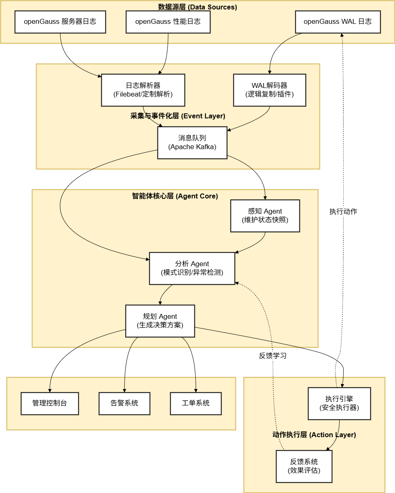
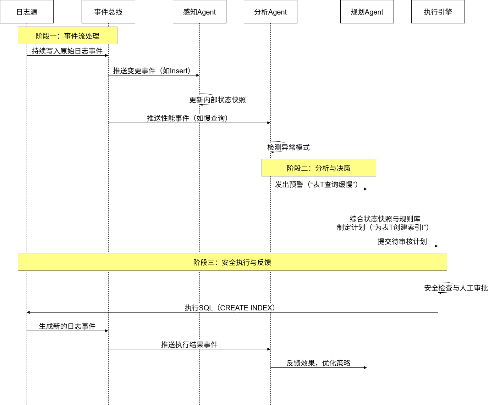
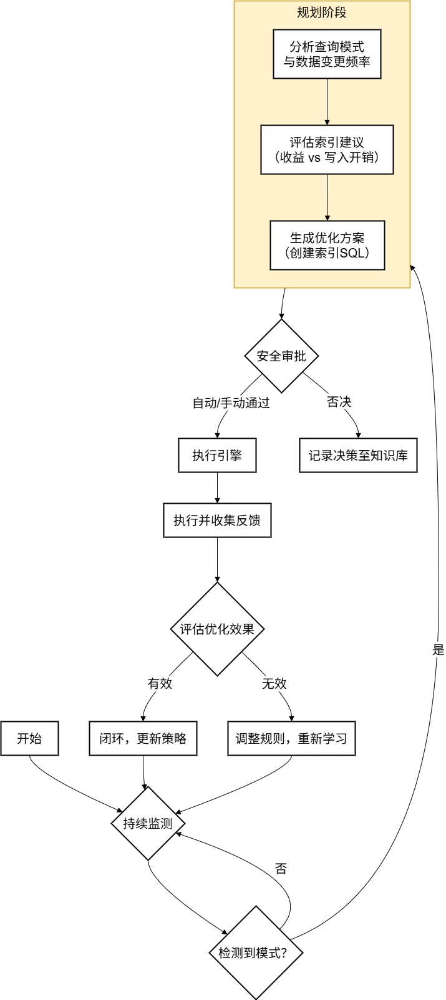

# 数据库日志驱动的 Agent 规划调研与方案（SOW）

## 调研：数据库日志方案对比

| 数据库/方案           | 核心日志机制                                                                       | 典型应用场景                        | 关键技术/工具                                                                                                                                            | 启示/适配点                                                                                                        |
| --------------------- | ---------------------------------------------------------------------------------- | ----------------------------------- | -------------------------------------------------------------------------------------------------------------------------------------------------------- | ------------------------------------------------------------------------------------------------------------------ |
| Oracle                | [物理日志 (Redo Log)](https://bbs.huaweicloud.com/blogs/460724)                       | 崩溃恢复、数据同步、历史分析        | [LogMiner（内置解析）](https://www.yisu.com/ask/11788989.html)、OGG (GoldenGate)                                                                            | 物理日志记录数据块变化,与存储格式解耦,便于跨平台迁移和复杂恢复。其内置LogMiner工具提供了成熟的日志解析范例。       |
| MySQL / 云服务        | [逻辑日志 (binlog - ROW模式)](https://www.ctyun.cn/developer/article/722510442340421) | 实时同步(CDC)、数据追补、跨机房复制 | Canal、Debezium、[Flink (流处理)](https://www.ctyun.cn/developer/article/722510442340421)                                                                   | 聚焦逻辑变更流（行级增删改）,通过解析工具与消息队列（如 Kafka）、流计算引擎集成,构建实时数据管道。                 |
| PostgreSQL/KingbaseES | [预写日志 (WAL)](https://tapdata.net/kingbasees-to-doris-real-time-sync.html)         | 逻辑复制、增量同步                  | 逻辑解码插件(pgoutput, wal2json)、[TapData](https://tapdata.net/kingbasees-to-doris-real-time-sync.html)                                                    | 通过逻辑复制槽和解码插件将WAL转换为逻辑变更,是实现 CDC 的关键。类 PG 数据库（如 KingbaseES）存在适配门槛。         |
| AI增强分析            | - (不特定于数据库)                                                                 | 智能运维、根因分析、日志摘要        | [多智能体（Multi-Agent）框架、RAG、LLM](https://developer.nvidia.cn/blog/build-a-log-analysis-multi-agent-self-corrective-rag-system-with-nvidia-nemotron/) | 展示了利用 AI 技术（如多智能体协作、检索增强生成 RAG）对非结构化或半结构化日志进行深度分析、归纳和推理的先进思路。 |

## 调研：与现有 opengauss 现有方案对比

| 维度         | 现有 openGauss AI/Agent 方案 (典型代表)                                                                                                                            | 日志驱动智能体规划方案 (本方案)                                                                    |
| :----------- | :----------------------------------------------------------------------------------------------------------------------------------------------------------------- | :------------------------------------------------------------------------------------------------- |
| 核心目标     | **“向外赋能”**：&#10;赋能AI应用，提升其与数据库交互的智能性、便捷性和效率。                                                                                | **“向内自治”**：&#10;实现数据库自身的自动化运维与智能管控，降低人工干预成本。              |
| 技术焦点     | - 向量检索与RAG：为AI提供语义化知识检索能力。&#10;- MCP协议：标准化LLM与数据库的交互。&#10;- DB4AI：库内机器学习。&#10;- AI智能索引/调参：基于AI函数提供优化建议。 | 数据库日志的实时解析、事件化与模式识别，&#10;基于事件流驱动智能体进行规划与决策。                  |
| 主要数据源   | **业务数据**（向量、表数据）、模型数据、自然语言查询。                                                                                                       | **数据库内部日志**（WAL、性能日志、服务器日志等）。                                          |
| 核心方法     | - 向量相似性计算、Embedding。&#10;- 自然语言到SQL的转换。&#10;- 数据库内机器学习算子。&#10;- AI函数调用与推荐算法。                                                | - 逻辑解码（WAL→事件流）。&#10;- 日志解析与事件标准化。&#10;- 实时状态感知与规则/模型驱动的规划。 |
| 输出结果     | - 语义检索结果、自然语言问答。&#10;- 模型预测结果、AI推荐的脚本。&#10;- 通过MCP执行的SQL结果。                                                                     | 自动化运维动作或指令&#10;（如索引管理、故障恢复预案、资源调整建议等）。                            |
| 集成方式     | - 通过MCP Server与LLM生态集成。&#10;- 通过应用框架构建AI Agent。&#10;- 通过SQL接口调用DB4AI功能。                                                                  | - 通过消息队列（如Kafka） 接收日志事件流。&#10;- 通过执行引擎安全执行生成的运维指令。              |
| 典型应用场景 | - 智能问答助手。&#10;- 自然语言查询数据分析。&#10;- 数据库内模型训练与预测。&#10;- AI辅助的SQL优化。                                                               | - 慢查询自动优化。&#10;- 异常事务自愈。&#10;- 资源智能调度。&#10;- 故障预测与预防。                |

## openGauss的适用性分析

openGauss 基于 PostgreSQL，其日志体系具备支持 Agent 规划的潜力，但也面临挑战。

* **技术基础与优势**：
  * WAL日志机制：openGauss 采用[预写日志（WAL）](https://bbs.huaweicloud.com/blogs/460724)确保数据持久性。其逻辑日志 （尤其在内存引擎MOT中）记录行级变更，相比物理日志体积更小。
  * 现有CDC支持：[社区已提供 **`gs_replicate`** 工具](https://docs.opengauss.org/zh/docs/7.0.0-RC2/docs/AboutopenGauss/%E5%8F%8D%E5%90%91%E8%BF%81%E7%A7%BBgs_replicate.html)，通过逻辑复制槽和 `mppdb_decoding`（或 `pgoutput`）插件，可将增量数据（DML）迁移至MySQL等。这证明了 **WAL日志可以被可靠地解析并转换为数据流** 。
  * 日志管理完善：提供全面的[日志参数配置](https://docs.opengauss.org/zh/docs/3.1.0-lite/docs/Developerguide/%E8%AE%B0%E5%BD%95%E6%97%A5%E5%BF%97%E7%9A%84%E4%BD%8D%E7%BD%AE.html)（如输出目的地、轮转策略等），便于收集和管理。
* **挑战与待拓展领域**：
  * 日志类型局限：当前官方文档重点介绍了用于性能调优的[性能日志](https://docs.opengauss.org/zh/docs/7.0.0-RC1-lite/docs/PerformanceTuningGuide/%E6%80%A7%E8%83%BD%E6%97%A5%E5%BF%97.html)和常规的[运行、审计日志](https://docs.opengauss.org/zh/docs/3.1.0-lite/docs/Developerguide/%E8%AE%B0%E5%BD%95%E6%97%A5%E5%BF%97%E7%9A%84%E4%BD%8D%E7%BD%AE.html)。直接用于描述业务语义的高级操作日志或规划所需的状态快照可能需额外设计。
  * 生态工具缺口：相较于MySQL庞大的CDC生态，openGauss在将 WAL 变更流实时对接至流处理平台（如Flink）或消息队列方面，社区的开源工具和成熟案例较少。
  * 智能化分析缺失：原生能力缺乏对日志内容的**自动模式识别、异常检测和预测性分析** ，这正是 AI Agent 可以发挥价值的地方。

# openGauss数据库日志驱动的智能体规划方案

## 项目概述

* **目标** ：为openGauss数据库设计并实现一个基于日志分析的智能体（Agent）规划原型系统。该系统通过实时解析数据库日志，感知系统状态与业务变更，进而自动执行优化、告警或生成运维建议。
* **范围** ：
  * 前期：聚焦于 **增量数据变更日志（WAL）的捕获与实时流式输出** 。
  * 后期：探索对**性能日志、错误日志**等多源日志的融合分析，并引入轻量级AI模型进行智能决策。

## 系统架构设计

本方案采用分层、事件驱动的架构，确保系统的松耦合与高内聚。

**架构说明**：

- 数据源层：系统输入，涵盖 openGauss 的核心日志。
- 采集与事件化层：将原始日志转换为统一格式的标准化事件，并汇入消息总线。
- 智能体核心层：多个专业化 Agent 协同工作，实现从感知到规划的完整认知链条。
- 动作执行层：负责将“规划”安全、可控地落地，并形成学习闭环。
- 外部系统：提供人机交互与集成接口。

**关键组件**：

- **WAL解码器**：这是方案的技术核心。需要基于 openGauss 的逻辑解码功能来实现。关键在于配置逻辑复制槽（例如通过 `pg_create_logical_replication_slot`）并选择合适的解码插件（如 `pgoutput` 或 openGauss 优化的 `mppdb_decoding`），将二进制 WAL 实时转换为可读的 JSON 或 SQL 格式的事件。
- **日志解析器**：用于处理 pg_log 目录下的 CSV 或文本日志。这可以通过定制 Python 脚本，或利用开源工具（如 Filebeat 的 dissect 或 grok 解析功能）来实现，提取慢查询、错误、检查点等关键事件。
- **感知 Agent**：充当系统的“记忆”，维护数据库虚拟快照（如表空间使用率、热点事务ID）。
- **分析 Agent**：应用规则引擎和统计模型，识别性能瓶颈、安全风险或优化机会。
- **规划 Agent**：根据分析结果和预定义策略，生成具体的动作序列（如SQL脚本、配置变更指令）。

## Agent协同工作机制

智能体之间通过事件流和状态共享进行协作，其核心工作流如下：

## **技术栈建议**

* **日志捕获** ：openGauss逻辑复制 + [`mppdb_decoding`插件](https://docs.opengauss.org/zh/docs/7.0.0-RC2/docs/AboutopenGauss/%E5%8F%8D%E5%90%91%E8%BF%81%E7%A7%BBgs_replicate.html)
* **事件流** ：Apache Kafka
* **Agent开发** ：Python（异步框架）， LangChain / LangGraph（用于编排[多 Agent 工作流](https://developer.nvidia.cn/blog/build-a-log-analysis-multi-agent-self-corrective-rag-system-with-nvidia-nemotron/)）
* **存储与分析** ：时序数据库（存放指标）、Elasticsearch（[存放日志原文用于检索](https://cloud.tencent.cn/developer/article/2572849?policyId=1004)）
* **AI 模型** ：[本地部署的小参数 LLM 或向量检索模型](https://developer.nvidia.cn/blog/build-a-log-analysis-multi-agent-self-corrective-rag-system-with-nvidia-nemotron/)

## 试点应用场景示例

以下以“慢查询自动优化”为例，展示系统从发现到解决的端到端流程。

场景流程阐述：

- 感知：分析 Agent 从事件流中识别出“某查询执行时间>阈值”且“其目标表存在高频更新”。
- 规划：规划 Agent 结合表结构、数据分布和更新模式，计算出最优索引方案。
- 审批：方案提交至执行引擎，触发审批流程（可配置为自动或人工）。

执行与学习：方案通过后执行，系统监控执行后该查询的性能提升效果，将此结果反馈给分析 Agent，用于完善未来的决策模型。

## 实施路径与风险控制

### 分阶段实施建议

第一阶段（数据基础）：搭建 openGauss 日志至 Kafka 的稳定管道，实现感知Agent对基础状态（如事务率）的监控。

第二阶段（规则驱动）：上线分析 Agent 与规划 Agent，实现 2-3 个基于明确规则的自动化场景（如索引推荐、连接池警告）。

第三阶段（智能增强）：引入机器学习模型，对日志进行异常检测和根因分析预测。

### 主要风险与应对

| 风险点           | 可能影响                             | 缓解措施                                                 |
| ---------------- | ------------------------------------ | -------------------------------------------------------- |
| 对生产库性能影响 | 开启逻辑复制可能增加负载。           | 在业务低峰期部署和测试；密切监控源库资源使用。           |
| 自动化执行风险   | 误操作可能导致服务中断。             | 建立分级审批流程；所有生产变更先在沙箱环境验证。         |
| 方案有效性       | 规划的优化动作可能无效或产生副作用。 | 建立强反馈机制；初期以"建议"形式输出为主，而非自动执行。 |

## 预期成果与后续展望

本方案实施后，预期将建立一个可感知、可分析、可规划的openGauss智能运维原型。它将首先在降低重复性运维工作量和提前发现潜在问题两方面体现价值。

后续可基于此架构，探索更复杂的多Agent协作场景，例如与业务指标联动进行容量规划，或结合LLM实现更自然的日志分析与故障排查对话接口。整个系统的演进应始终遵循 “从辅助到自治，从规则到智能” 的原则。
