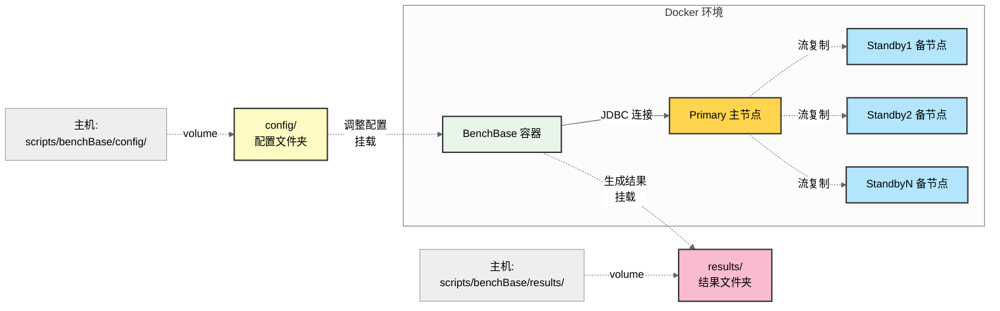
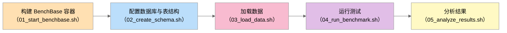
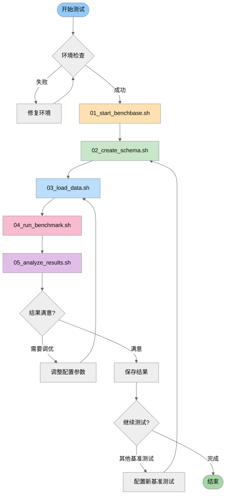

# BenchBase 基准测试框架使用指南

> 基于 CMU BenchBase 框架对 openGauss 数据库进行全面性能测试

## 一、BenchBase 简介

BenchBase（原 OLTP-Bench）是 CMU 数据库组开发的**多数据库 SQL 基准测试框架**，通过 JDBC 连接支持多种关系型数据库。

**核心特性:**

- **多基准测试支持**: 包含 TPC-C、TPC-H、YCSB、SmallBank、TATP 等 19+ 基准测试
- **多线程负载生成**: 可配置并发度、事务混合比例、运行时间
- **详细性能指标**: 每种事务类型的延迟、吞吐量、直方图统计
- **多数据库支持**: PostgreSQL、MySQL、CockroachDB、SQLite 等（兼容 openGauss）
- **容器化部署**: 支持 Docker 和 Docker Compose

---

## 二、支持的基准测试场景

### 2.1 完整基准测试列表

| 基准测试               | 类型      | 应用场景     | 事务/查询数量 | 表数量 | 复杂度 | 配置状态  | 主要特点                         |
| ---------------------- | --------- | ------------ | ------------- | ------ | ------ | --------- | -------------------------------- |
| **TPC-C**        | OLTP      | 订单处理系统 | 5个事务       | 9张表  | 高     | ✅ 已配置 | 批发供应商业务，包含复杂关联事务 |
| **TPC-H**        | OLAP      | 决策支持系统 | 22个查询      | 8张表  | 很高   | 📋 待配置 | 复杂分析查询，大量JOIN和聚合     |
| **YCSB**         | Key-Value | 云服务基准   | 6种workload   | 1张表  | 中     | 📋 待配置 | 简单读写操作，测试扩展性         |
| **SmallBank**    | OLTP      | 银行应用     | 6个事务       | 3张表  | 低     | 📋 待配置 | 简单银行交易，轻量级测试         |
| **TATP**         | OLTP      | 电信应用     | 7个事务       | 4张表  | 中     | 📋 待配置 | 高并发简单事务                   |
| **Wikipedia**    | Web应用   | 维基百科     | 多种操作      | 6张表  | 中高   | 📋 待配置 | 真实Web访问模式，读多写少        |
| **Twitter**      | 社交网络  | 微博应用     | 多种操作      | 4张表  | 中高   | 📋 待配置 | 社交网络特征，高并发读写         |
| **AuctionMark**  | Web应用   | 在线拍卖     | 多种操作      | 9张表  | 中高   | 📋 待配置 | eBay类似场景，时间敏感事务       |
| **CH-benCHmark** | HTAP      | 混合负载     | TPC-C + TPC-H | 12张表 | 很高   | 📋 待配置 | OLTP和OLAP混合测试               |
| **SEATS**        | OLTP      | 航空订票     | 多种操作      | 9张表  | 中高   | 📋 待配置 | 复杂预订逻辑，竞争激烈           |
| **Voter**        | OLTP      | 投票系统     | 1个事务       | 2张表  | 低     | 📋 待配置 | 超高吞吐量测试                   |
| **SIBench**      | 隔离级别  | 快照隔离测试 | 特定事务      | 1张表  | 中     | 📋 待配置 | 测试并发控制机制                 |

> **说明**: 当前已完成 TPC-C 配置和测试，其他基准测试配置文件位于 `config/postgres/` 目录，可根据需要进行适配。

### 2.2 适用于 openGauss 的推荐场景

| 基准测试               | 测试目标           | 分布式特性                     |
| ---------------------- | ------------------ | ------------------------------ |
| **TPC-C**        | 分布式事务处理能力 | 跨节点事务、2PC、分布式锁      |
| **TPC-H**        | 分析查询性能       | 并行查询、分布式JOIN、聚合下推 |
| **YCSB**         | 扩展性和吞吐量     | 负载均衡、数据分片、缓存效果   |
| **SmallBank**    | 分布式事务一致性   | 账户转账、死锁检测、隔离级别   |
| **CH-benCHmark** | HTAP混合负载       | OLTP/OLAP隔离、资源管理        |
| **TATP**         | 高并发性能         | 最大吞吐量、连接池效率         |
| **Wikipedia**    | 真实Web场景        | 读写分离、热点数据处理         |

---

## 三、部署架构

### 3.1 系统拓扑图



### 3.2 工作流程图



**流程说明:**

1. **构建 BenchBase**: 拉取 Docker 镜像
2. **配置数据库**: 编辑 `config/tpcc_config.xml` 等配置文件
3. **创建表结构**: 执行 `--create=true` 初始化数据库 schema
4. **加载数据**: 执行 `--load=true` 批量插入测试数据
5. **运行测试**: 执行 `--execute=true` 进行压力测试
6. **分析结果**: 查看 `results/` 目录下的性能报告

---

## 四、快速开始

### 4.1 方式一：一键运行（推荐）

```bash
cd scripts/benchBase

# 1. 设置脚本执行权限
chmod +x *.sh

# 2. 运行完整测试流程
./run_all.sh
```

### 4.2 方式二：分步执行

适用于需要单独调试或自定义流程的场景：

```bash
# 步骤1: 启动容器
./01_start_benchbase.sh

# 步骤2: 创建 Schema（自动创建数据库和用户）
./02_create_schema.sh

# 步骤3: 加载数据（耗时较长，取决于 scalefactor）
./03_load_data.sh

# 步骤4: 执行测试
./04_run_benchmark.sh

# 步骤5: 分析结果（输出到屏幕和文件）
./05_analyze_results.sh
```

---

## 六、配置文件说明

### 6.1 TPC-C 配置

> 配置文件路径：`config/tpcc_config.xml`

**主要配置项**（配置文件中已有详细注释）：

- `<scalefactor>` - 仓库数量（数据规模）
- `<terminals>` - 并发终端数
- `<time>` - 测试时长（秒）
- `<warmup>` - 预热时间（秒）
- `<loaderThreads>` - 数据加载线程数

### 6.2 其他基准测试配置

其他基准测试的配置模板位于 `config/postgres/` 目录：

```bash
# 查看可用配置模板
ls config/postgres/

# 复制并修改配置（以 SmallBank 为例）
cp config/postgres/sample_smallbank_config.xml config/smallbank_config.xml
vim config/smallbank_config.xml
```

**修改要点**：

1. 数据库连接信息（url、username、password）
2. 规模参数（scalefactor）
3. 并发参数（terminals）
4. 测试时长（time）

---

## 六、测试结果说明

### 6.1 性能指标解读

测试结果保存在 `results/` 目录，包含：

#### 核心指标

| 指标                        | 说明                                   | 单位         |
| --------------------------- | -------------------------------------- | ------------ |
| **Throughput**        | 每秒处理的事务数                       | requests/sec |
| **tpmC**              | 每分钟新订单事务数（Throughput × 60） | txn/min      |
| **Goodput**           | 有效吞吐量（成功事务）                 | requests/sec |
| **Measured Requests** | 总测试请求数                           | 次           |

#### 延迟分布

| 指标                            | 说明              | 评价标准                              |
| ------------------------------- | ----------------- | ------------------------------------- |
| **Minimum Latency**       | 最小延迟          | -                                     |
| **Median Latency (P50)**  | 中位延迟          | -                                     |
| **Average Latency**       | 平均延迟          | -                                     |
| **95th Percentile (P95)** | 95%请求的延迟上限 | <50ms 优秀，<100ms 良好，<200ms 一般  |
| **99th Percentile (P99)** | 99%请求的延迟上限 | <100ms 优秀，<200ms 良好，<500ms 一般 |
| **Maximum Latency**       | 最大延迟          | 反映性能毛刺                          |

### 6.2 查看结果

```bash
# 方式1: 查看自动生成的文本报告（推荐）
cat results/<测试名+日期>/final_result.txt

# 方式2: 运行分析脚本
./05_analyze_results.sh -t tpcc

# 方式43: 查看原始事务数据
head -50 results/<测试名+日期>/*.raw.csv

# 方式4: 查看各事务类型详细结果
ls results/<测试名+日期>/*.results.*.csv
```

### 6.3 不同规模测试配置

| 场景       | scalefactor | terminals | time | 数据量 | 适用场景           |
| ---------- | ----------- | --------- | ---- | ------ | ------------------ |
| 快速验证   | 5           | 8         | 30s  | ~500MB | 功能测试、环境验证 |
| 标准测试   | 10          | 16        | 60s  | ~1GB   | 日常性能测试       |
| 压力测试   | 50          | 64        | 300s | ~5GB   | 极限性能、容量规划 |
| 大规模测试 | 100+        | 128+      | 600s | 10GB+  | 生产环境模拟       |

---

## 七、扩展到其他基准测试

### 7.1 使用 -t 参数运行不同基准测试

所有脚本现已支持 `-t` 参数来指定基准测试类型：

```bash
# 运行 SmallBank 测试
./02_create_schema.sh -t smallbank
./03_load_data.sh -t smallbank
./04_run_benchmark.sh -t smallbank
./05_analyze_results.sh -t smallbank

# 运行 YCSB 测试
./02_create_schema.sh -t ycsb
./03_load_data.sh -t ycsb
./04_run_benchmark.sh -t ycsb
./05_analyze_results.sh -t ycsb

# 查看帮助
./02_create_schema.sh -h
```

### 7.2 配置新的基准测试

**步骤1: 选择配置模板**

```bash
# 查看可用配置模板
ls config/postgres/

# 示例输出:
# sample_tpcc_config.xml       (TPC-C 订单处理)
# sample_smallbank_config.xml  (银行交易)
# sample_ycsb_config.xml       (云服务基准)
# sample_tatp_config.xml       (电信应用)
# sample_tpch_config.xml       (TPC-H 分析查询)
# sample_wikipedia_config.xml  (维基百科)
# ...
```

**步骤2: 复制并修改配置**

```bash
# 以 SmallBank 为例
cp config/postgres/sample_smallbank_config.xml config/smallbank_config.xml

# 编辑配置文件（配置文件中已有详细注释）
vim config/smallbank_config.xml
```

**步骤3: 修改关键参数**

配置文件中需要修改的主要参数：

- 数据库连接信息（url、username、password）
- 规模参数（scalefactor）
- 并发参数（terminals）
- 测试时长（time）

**步骤4: 运行测试**

```bash
# 使用 -t 参数指定基准测试类型
./02_create_schema.sh -t smallbank
./03_load_data.sh -t smallbank
./04_run_benchmark.sh -t smallbank
./05_analyze_results.sh -t smallbank
```

### 7.3 推荐的测试顺序

建议按以下顺序逐步测试，从简单到复杂：

1. **TPC-C** - OLTP 基础性能
2. **SmallBank** - 简单事务，快速验证
3. **YCSB** - 扩展性测试
4. **TATP** - 高并发测试
5. **TPC-H** - OLAP 分析查询
6. **Wikipedia** - Web 应用场景
7. **CH-benCHmark** - HTAP 混合负载

---

## 八、脚本功能详解

### 8.1 核心脚本

| 脚本                      | 功能                     | 支持参数           | 主要检查项                |
| ------------------------- | ------------------------ | ------------------ | ------------------------- |
| `01_start_benchbase.sh` | 拉取官方镜像并启动容器   | 无                 | Docker网络、openGauss连接 |
| `02_create_schema.sh`   | 创建数据库、用户和表结构 | `-t <benchmark>` | 容器状态、配置文件        |
| `03_load_data.sh`       | 批量加载测试数据         | `-t <benchmark>` | 容器状态、磁盘空间        |
| `04_run_benchmark.sh`   | 执行基准测试             | `-t <benchmark>` | 容器状态、数据已加载      |
| `05_analyze_results.sh` | 解析并展示结果           | `-t <benchmark>` | 结果文件存在、Python环境  |

**使用示例：**

```bash
# 默认使用 tpcc
./02_create_schema.sh

# 指定其他基准测试
./02_create_schema.sh -t smallbank
./02_create_schema.sh -t ycsb

# 查看帮助
./02_create_schema.sh -h
```

### 8.2 分析脚本

| 脚本                   | 功能           | 输出                                |
| ---------------------- | -------------- | ----------------------------------- |
| `analyze_results.py` | Python分析脚本 | 屏幕输出 + results/final_result.txt |

**使用方式:**

```bash
# 分析最新结果
python3 analyze_tpcc_results.py

# 分析指定文件
python3 analyze_results.py results/tpcc_2025-12-02_06-41-30.summary.json

# 查看保存的文本报告
cat results/tpcc_result.txt
```

### 8.3 辅助脚本

| 脚本             | 功能             | 使用场景             |
| ---------------- | ---------------- | -------------------- |
| `benchBase.sh` | 一键运行完整流程 | 首次测试、自动化测试 |

**注意**: [`benchBase.sh`](../../scripts/benchBase.sh) 目前默认使用 `tpcc`，后续将支持 `-t` 参数。

---

## 九、参考资源

- [BenchBase GitHub 仓库](https://github.com/cmu-db/benchbase)
- [TPC-C 官方规范](http://www.tpc.org/tpcc/)
- [TPC-H 官方规范](http://www.tpc.org/tpch/)
- [OLTP-Bench 论文 (VLDB 2014)](http://www.vldb.org/pvldb/vol7/p277-difallah.pdf)

---

## 附录：完整测试工作流


