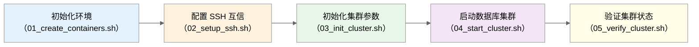
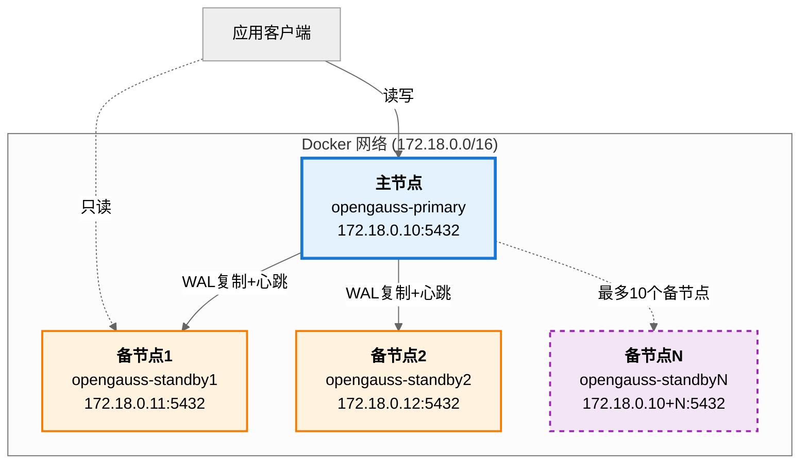
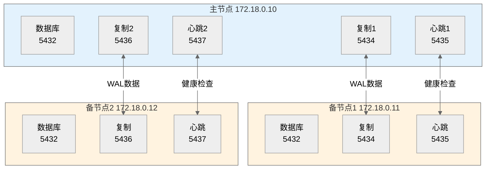
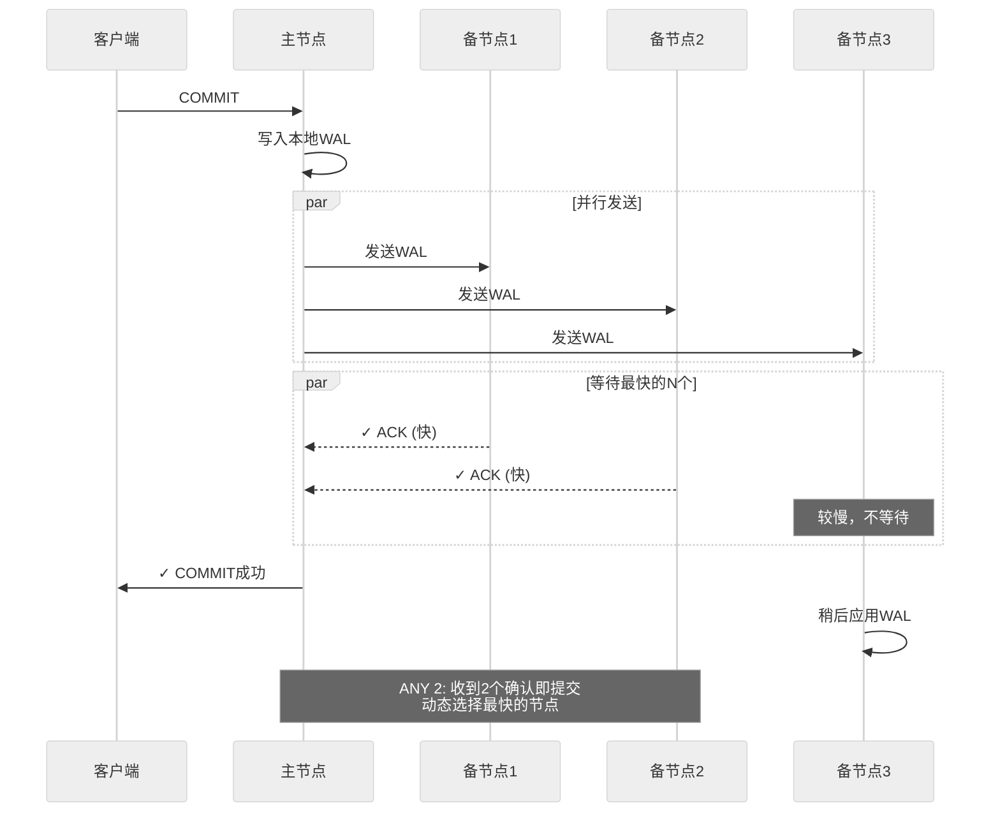
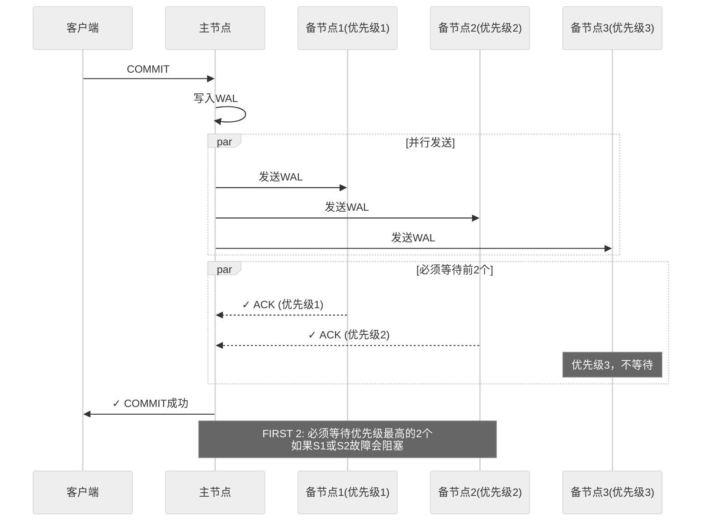
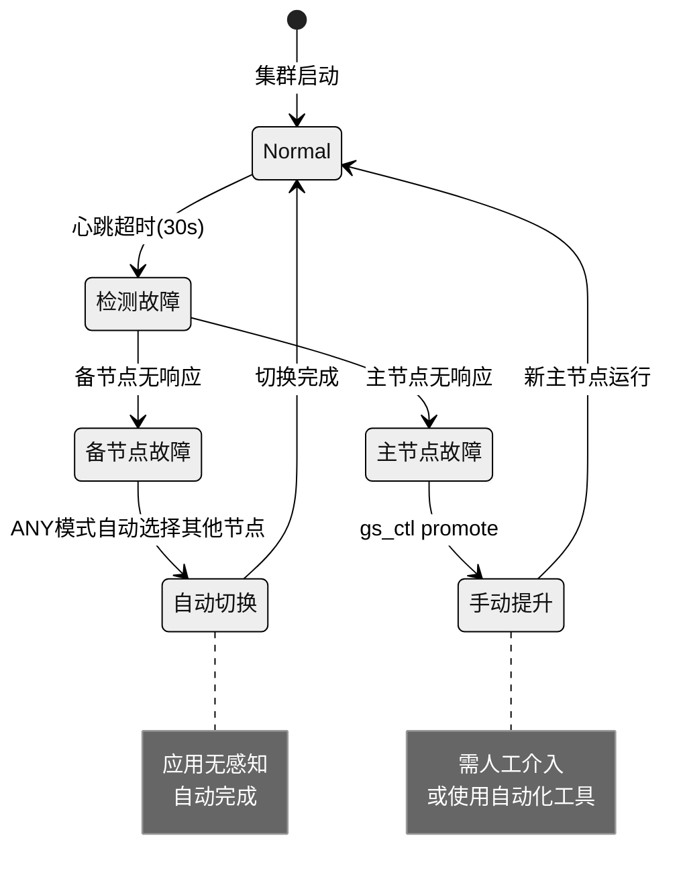

# openGauss 主备集群部署指南

> 🚀 **一键部署 | 动态扩展 | 多种复制模式**
> 基于 Docker 容器的 openGauss 高可用集群快速部署方案

[](https://opengauss.org/)
[](https://www.docker.com/)

---

## 📋 目录

- [快速开始](#快速开始)
- [集群架构](#集群架构)
- [部署流程](#部署流程)
- [复制模式](#复制模式)
- [验证与监控](#验证与监控)
- [技术细节](#技术细节)
- [参考文献](#参考文献)

---

## 🚀 快速开始

### 一键部署

```bash
# 进入脚本目录
cd scripts

# 自动部署（1主2备，ANY1模式）
./multi-node.sh -y

# 自定义配置
./multi-node.sh -n 4 -m ANY2  # 1主4备，ANY2模式
```

### 手动部署



| 步骤 | 脚本                        | 参数        | 说明                       |
| ---- | --------------------------- | ----------- | -------------------------- |
| 1    | `01_create_containers.sh` | `-n N`    | 创建容器（1主N备，N=1-10） |
| 2    | `02_setup_ssh.sh`         | 无          | 配置SSH互信（可选）        |
| 3    | `03_init_cluster.sh`      | `-m MODE` | 初始化并配置复制模式       |
| 4    | `04_start_cluster.sh`     | 无          | 启动所有节点               |
| 5    | `05_verify_cluster.sh`    | 无          | 验证集群状态               |

**示例：**

```bash
cd scripts/multi-node

./01_create_containers.sh -n 3    # 创建1主3备
./02_setup_ssh.sh                  # 配置SSH（可选）
./03_init_cluster.sh -m ANY2       # 初始化，ANY2模式
./04_start_cluster.sh              # 启动集群
./05_verify_cluster.sh             # 验证状态
```

### 关键配置文件

#### postgresql.conf（主节点）

**脚本参考：** `03_init_cluster.sh` 第 94-107 行

```ini
# 网络
listen_addresses = '*'
port = 5432

# WAL复制
wal_level = hot_standby              # 支持热备[[2]](#ref2)
max_wal_senders = 10                  # 最大复制连接数
wal_keep_segments = 256               # 保留WAL段数

# 备节点
hot_standby = on                      # 允许备节点只读查询[[5]](#ref5)

# 同步复制（动态生成）
synchronous_standby_names = 'ANY 1(standby1,standby2)'  # [[6]](#ref6)[[7]](#ref7)

# 复制通道（每个备节点）
replconninfo1 = 'localhost=172.18.0.10 localport=5434 ...'  # [[1]](#ref1)
replconninfo2 = 'localhost=172.18.0.10 localport=5436 ...'
```

#### pg_hba.conf（认证）

**脚本参考：** `03_init_cluster.sh` 第 121-130 行

```ini
# 本地连接
local   all             all                         trust
host    all             all         127.0.0.1/32    trust

# 集群内部
host    all             all         172.18.0.0/16   sha256

# 流复制（每个备节点）[[11]](#ref11)
host    replication     omm         172.18.0.11/32  trust
host    replication     omm         172.18.0.12/32  trust
```

#### recovery.conf（备节点）

**脚本参考：** `03_init_cluster.sh` 第 155-160 行

```ini
standby_mode = 'on'                                          # [[12]](#ref12)
primary_conninfo = 'host=172.18.0.10 port=5432 user=omm application_name=standby1'
recovery_target_timeline = 'latest'
```

---

## 🏗️ 集群架构

### 拓扑结构



### 节点配置表

| 节点    | 容器名                 | IP地址        | 内部端口 | 宿主机端口 | 角色 |
| ------- | ---------------------- | ------------- | -------- | ---------- | ---- |
| 主节点  | `opengauss-primary`  | 172.18.0.10   | 5432     | 15432      | 读写 |
| 备节点1 | `opengauss-standby1` | 172.18.0.11   | 5432     | 15433      | 只读 |
| 备节点2 | `opengauss-standby2` | 172.18.0.12   | 5432     | 15434      | 只读 |
| 备节点N | `opengauss-standbyN` | 172.18.0.10+N | 5432     | 15432+N    | 只读 |

**脚本参考：** `01_create_containers.sh` 第 64-104 行

### 网络通信



**端口分配规则：**（`03_init_cluster.sh` 第 112-115 行）

```bash
# 备节点索引 i (从0开始)
复制端口 = 5434 + i × 2
心跳端口 = 5435 + i × 2
```

| 备节点   | 索引i | 复制端口      | 心跳端口      |
| -------- | ----- | ------------- | ------------- |
| standby1 | 0     | 5434          | 5435          |
| standby2 | 1     | 5436          | 5437          |
| standby3 | 2     | 5438          | 5439          |
| standbyN | N-1   | 5434+(N-1)×2 | 5435+(N-1)×2 |

---

## 🔄 复制模式

> **理论基础：** openGauss 支持同步/异步复制和 Quorum Commit 机制[[6]](#ref6)[[7]](#ref7)

### 模式对比

| 模式             | 配置语法         | 同步节点数 | 性能     | 可靠性     | 适用场景           |
| ---------------- | ---------------- | ---------- | -------- | ---------- | ------------------ |
| **ANY1**   | `ANY 1(...)`   | 任意1个    | ⚡⚡⚡   | ⭐⭐⭐     | **生产推荐** |
| **ANY2**   | `ANY 2(...)`   | 任意2个    | ⚡⚡     | ⭐⭐⭐⭐   | 金融/关键业务      |
| **FIRST1** | `FIRST 1(...)` | 第1个      | ⚡⚡⚡   | ⭐⭐⭐     | 固定拓扑           |
| **FIRST2** | `FIRST 2(...)` | 前2个      | ⚡⚡     | ⭐⭐⭐⭐   | 跨机房             |
| **SYNC**   | `ANY N(...)`   | 全部       | ⚡       | ⭐⭐⭐⭐⭐ | 极高可靠性         |
| **ASYNC**  | `''` (空)      | 0          | ⚡⚡⚡⚡ | ⭐⭐       | 性能优先           |

**脚本实现：** `03_init_cluster.sh` 第 69-84 行

```bash
case $REPLICATION_MODE in
    ANY*)   # 任意N个确认即可
        SYNC_NUM=${REPLICATION_MODE#ANY}
        SYNC_STANDBY_CONFIG="synchronous_standby_names = 'ANY $SYNC_NUM($STANDBY_LIST)'"
        ;;
    FIRST*) # 必须等待前N个
        SYNC_NUM=${REPLICATION_MODE#FIRST}
        SYNC_STANDBY_CONFIG="synchronous_standby_names = 'FIRST $SYNC_NUM($STANDBY_LIST)'"
        ;;
    SYNC)   # 全部同步
        SYNC_STANDBY_CONFIG="synchronous_standby_names = 'ANY $STANDBY_COUNT($STANDBY_LIST)'"
        ;;
    ASYNC)  # 异步模式
        SYNC_STANDBY_CONFIG="synchronous_standby_names = ''"
        ;;
esac
```

### 事务提交流程

#### ANY N 模式（推荐）



#### FIRST N 模式



### sync_state 状态

**脚本验证：** `05_verify_cluster.sh` 第 76-88 行

| 状态          | 含义         | 阻塞事务 | 参考      |
| ------------- | ------------ | -------- | --------- |
| `Quorum`    | 法定人数模式 | ✅       | [[7]](#ref7) |
| `Sync`      | 同步模式     | ✅       | [[6]](#ref6) |
| `Potential` | 潜在同步节点 | ❌       | [[1]](#ref1) |
| `Async`     | 异步复制     | ❌       | [[6]](#ref6) |

---

## ✅ 验证与监控

### 自动验证

**脚本：** `05_verify_cluster.sh`

```bash
./05_verify_cluster.sh
```

**输出示例：**

```
=== openGauss 集群自动验证 ===

📊 集群配置: 1 主节点 + 2 备节点

🔍 [1/5] 检查主节点状态... ✅ 通过
🔍 [2/5] 检查备节点状态... ✅ 通过 (2/2)
🔍 [3/5] 检查复制连接... ✅ 通过 (2/2)
🔍 [4/5] 检查同步状态... ✅ 通过 (2/2 Streaming)
🔍 [5/5] 检查复制模式... ✅ 通过 (ANY1(standby1,standby2))

━━━━━━━━━━━━━━━━━━━━━━━━━━━━━━━━━━━━━━━━
📋 复制状态详情
━━━━━━━━━━━━━━━━━━━━━━━━━━━━━━━━━━━━━━━━
 节点      | IP地址        | 状态      | 同步状态  | 优先级
-----------+---------------+-----------+-----------+--------
 standby1  | 172.18.0.11  | Streaming | Quorum    | 1
 standby2  | 172.18.0.12  | Streaming | Potential | 0

🎉 集群验证通过！
```

### 监控查询

```sql
-- 主节点：查看复制状态 [[13]](#ref13)
SELECT 
    application_name AS 节点,
    client_addr AS IP,
    state AS 状态,
    sync_state AS 同步状态,
    sync_priority AS 优先级
FROM pg_stat_replication;

-- 备节点：查看复制延迟
SELECT now() - pg_last_xact_replay_timestamp() AS 延迟;
```

### 故障检测机制



| 故障类型   | 检测方式    | 检测时间 | 系统响应                 |
| ---------- | ----------- | -------- | ------------------------ |
| 备节点宕机 | 心跳+TCP    | ~30s     | ANY模式自动切换[[3]](#ref3) |
| 主节点宕机 | 备节点检测  | ~60s     | 需手动提升备节点         |
| 网络中断   | 心跳超时    | ~30s     | 标记为disconnected       |
| 复制延迟   | WAL发送超时 | 60s      | 事务阻塞或降级           |

---

## 🔧 技术细节

### replconninfo 配置详解

**主节点配置：**（`03_init_cluster.sh` 第 113-115 行）

```ini
replconninfo1 = 'localhost=172.18.0.10 localport=5434 localheartbeatport=5435 
                 localservice=5432 remotehost=172.18.0.11 remoteport=5434 
                 remoteheartbeatport=5435 remoteservice=5432'
```

**备节点配置：**（`03_init_cluster.sh` 第 167-175 行）

```ini
replconninfo1 = 'localhost=172.18.0.11 localport=5434 localheartbeatport=5435 
                 localservice=5432 remotehost=172.18.0.10 remoteport=5434 
                 remoteheartbeatport=5435 remoteservice=5432'
```

| 参数                   | 说明        | 主节点示例  | 备节点示例  |
| ---------------------- | ----------- | ----------- | ----------- |
| `localhost`          | 本地IP      | 172.18.0.10 | 172.18.0.11 |
| `localport`          | WAL复制端口 | 5434        | 5434        |
| `localheartbeatport` | 心跳端口    | 5435        | 5435        |
| `remotehost`         | 对端IP      | 172.18.0.11 | 172.18.0.10 |

### Docker 网络配置

**脚本参考：** `01_create_containers.sh` 第 60-62 行

```bash
# 创建专用网络
docker network create \
    --driver bridge \
    --subnet=172.18.0.0/16 \
    --gateway=172.18.0.1 \
    opengauss-network

# 静态IP分配
docker run --network opengauss-network --ip 172.18.0.10 ...  # 主节点
docker run --network opengauss-network --ip 172.18.0.11 ...  # 备节点1
```

### SSH 互信配置

**脚本参考：** `02_setup_ssh.sh`


**作用：**

- ✅ 方便节点间手动管理
- ✅ 某些工具需要SSH连接
- ⚠️ 对集群复制非必需（复制使用TCP直连）

## 🔗 参考文献

[1] openGauss 社区. "openGauss 数据库文档". Gitee openGauss Docs. https://gitee.com/opengauss/docs
_说明：openGauss 官方文档托管在 Gitee，包含完整的技术文档和开发指南_

[2] PostgreSQL Global Development Group. "Write-Ahead Logging (WAL)". PostgreSQL 16 Documentation. https://www.postgresql.org/docs/current/wal-intro.html

[3] openGauss 社区. "openGauss 技术架构". openGauss 官网. https://opengauss.org/zh/
_说明：openGauss 首页包含高可靠性、故障切换等核心技术特性介绍_

[4] Docker Inc. "Networking overview". Docker Documentation. https://docs.docker.com/network/

[5] PostgreSQL Global Development Group. "Hot Standby". PostgreSQL 16 Documentation. https://www.postgresql.org/docs/current/hot-standby.html

[6] PostgreSQL Global Development Group. "Synchronous Replication". PostgreSQL 16 Documentation. https://www.postgresql.org/docs/current/warm-standby.html#SYNCHRONOUS-REPLICATION

[7] PostgreSQL Global Development Group. "synchronous_standby_names". PostgreSQL 16 Documentation. https://www.postgresql.org/docs/current/runtime-config-replication.html#GUC-SYNCHRONOUS-STANDBY-NAMES

[8] Kleppmann, M. (2017). _Designing Data-Intensive Applications: The Big Ideas Behind Reliable, Scalable, and Maintainable Systems_. O'Reilly Media. ISBN: 978-1491903063.
在线访问: https://ddia.vonng.com/ch6/
_说明：第6章"Replication"详细讨论了数据库复制机制的设计权衡_

[9] EnMotech. "openGauss Docker 镜像". Docker Hub. https://hub.docker.com/r/enmotech/opengauss
_说明：openGauss 容器镜像的官方仓库，包含部署和配置说明_

[10] PostgreSQL Global Development Group. "Replication Configuration". PostgreSQL 16 Documentation. https://www.postgresql.org/docs/current/runtime-config-replication.html

[11] PostgreSQL Global Development Group. "Client Authentication". PostgreSQL 16 Documentation. https://www.postgresql.org/docs/current/client-authentication.html

[12] PostgreSQL Global Development Group. "Recovery Configuration". PostgreSQL 16 Documentation. https://www.postgresql.org/docs/current/recovery-config.html

[13] PostgreSQL Global Development Group. "Monitoring Statistics". PostgreSQL 16 Documentation. https://www.postgresql.org/docs/current/monitoring-stats.html

[14] PostgreSQL Global Development Group. "High Availability, Load Balancing, and Replication". PostgreSQL 16 Documentation. https://www.postgresql.org/docs/current/high-availability.html
_说明：包含心跳检测和故障切换机制的详细说明_

[15] PostgreSQL Global Development Group. "Connections and Authentication". PostgreSQL 16 Documentation. https://www.postgresql.org/docs/current/runtime-config-connection.html
_说明：TCP keepalive 和连接超时参数配置_
